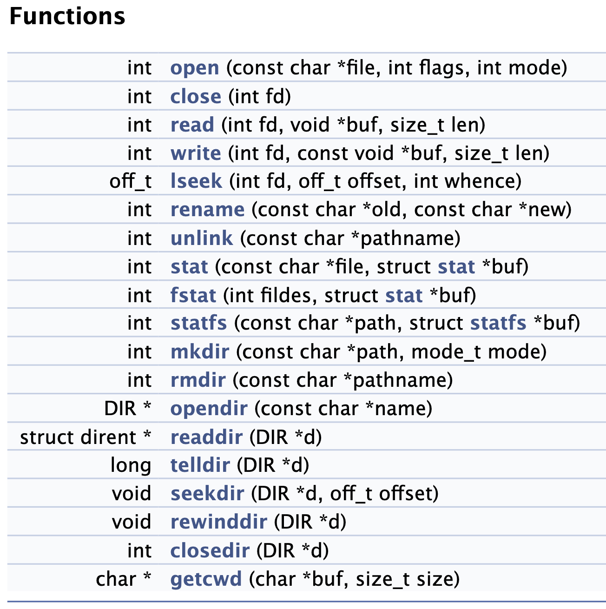

# 可行性报告
<!-- vscode-markdown-toc -->
* 1. [理论依据](#)
	* 1.1. [FreeRTOS信号量相关](#FreeRTOS)
		* 1.1.1. [ff_fread](#ff_fread)
		* 1.1.2. [FF_Read](#FF_Read)
		* 1.1.3. [小结](#-1)
	* 1.2. [RT-Thread的文件系统抽象设计](#RT-Thread)
		* 1.2.1. [RT-Thread的文件系统](#RT-Thread-1)
	* 1.3. [RT-Thread的虚拟文件系统运作流程](#RT-Thread-1)
		* 1.3.1. [DFS结构与特点](#DFS)
		* 1.3.2. [如何挂载管理文件系统](#-1)
		* 1.3.3. [代码实现](#-1)
		* 1.3.4. [总结](#-1)
	* 1.4. [各个文件系统的格式区别](#-1)
	* 1.5. [缓存](#-1)
		* 1.5.1. [文件缓存简介](#-1)
		* 1.5.2. [文件缓存实现范例参考](#-1)
* 2. [技术依据](#-1)
	* 2.1. [利用QEMU对FreeRTOS进行模拟](#QEMUFreeRTOS)
		* 2.1.1. [Eclipse:](#Eclipse:)
		* 2.1.2. [STM32](#STM32)
		* 2.1.3. [用FreeRTOS运行程序](#FreeRTOS-1)
	* 2.2. [使用QEMU创建虚拟磁盘:](#QEMU:)
	* 2.3. [各个文件系统的库支持](#-1)
		* 2.3.1. [FAT](#FAT)
		* 2.3.2. [romfs](#romfs)
		* 2.3.3. [jffs2](#jffs2)
* 3. [创新点](#-1)
	* 3.1. [FreeRTOS上的VFS](#FreeRTOSVFS)
	* 3.2. [安全性](#-1)
	* 3.3. [缓存 - 性能提升](#-)
	* 3.4. [POSIX接口](#POSIX)
* 4. [概要设计](#-1)
	* 4.1. [ 需求目标](#-1)
		* 4.1.1. [外部接口](#-1)
		* 4.1.2. [总体结构 / 模块设计 / 处理流程](#-1)
	* 4.2. [开发路线](#-1)
		* 4.2.1. [Step1: 最小可行性验证](#Step1:)
		* 4.2.2. [Step2: 文件系统完善（POSIX标准完善）](#Step2:POSIX)
		* 4.2.3. [Step3：文件系统完善（添加底层系统）](#Step3)
		* 4.2.4. [Step4：性能优化](#Step4)

<!-- vscode-markdown-toc-config
	numbering=true
	autoSave=true
	/vscode-markdown-toc-config -->
<!-- /vscode-markdown-toc --># 可行性报告
##  1. <a name=''></a>理论依据
###  1.1. <a name='FreeRTOS'></a>FreeRTOS信号量相关
####  1.1.1. <a name='ff_fread'></a>ff_fread

函数调用关系：

```c
size_t ff_fread( void * pvBuffer,size_t xSize,size_t xItems,FF_FILE * pxStream )
	|--int32_t FF_Read( FF_FILE * pxFile,uint32_t ulElementSize,uint32_t ulCount,uint8_t * pucBuffer )
		|--FF_ReadPartial();FF_BlockRead();FF_ReadClusters();
			|--FF_GetBuffer,FF_ReleaseBuffer
                |--FF_PendSemaphore( pxIOManager->pvSemaphore );FF_ReleaseSemaphore( pxIOManager->pvSemaphore );
```

####  1.1.2. <a name='FF_Read'></a>FF_Read

该函数通过以下五个步骤来完成读取任务：

1. 读取字节直到达到扇区边界：FF_ReadPartial()
2. 读取扇区直到达到簇边界：FF_BlockRead()
3. 读取整个簇：FF_ReadClusters()
4. 读取剩余扇区：FF_BlockRead()
5. 读取剩余字节：FF_ReadPartial()

##### FF_ReadPartial() 

当ffconfigOPTIMISE_UNALIGNED_ACCESS为0或未定义时，它将通过调用FF_GetBuffer等函数以标准方式读取文件。如果文件缓冲区pxBuffer无法获取，则返回一个错误信息；否则将数据从缓冲区pxBuffer中复制到pucBuffer中，并返回已读取的字节数ulBytesRead，释放该缓冲区并将文件指针ulFilePointer增加ulCount。

而当ffconfigOPTIMISE_UNALIGNED_ACCESS不为0时，它将以优化的方式读取文件。在读取前，程序首先检查当前块是否需要读取。如果是，则调用FF_BlockRead函数将该块读入缓冲区中，并标记缓冲区为有效(即FF_BUFSTATE_VALID)。然后将数据从缓冲区pxFile->pucBuffer + ulRelBlockPos中复制到pucBuffer中，并返回已读取的字节数ulBytesRead。如果在此过程中发现这个块不是当前读取的最后一个块，则暂时不需要写回缓冲区。否则，如果该文件处于更新模式并且文件内容发生了更改，则调用FF_BlockWrite函数将缓冲区数据重新写入该块中。最后，程序判断下一次读取是否经过当前块，如果是，则将缓冲区标记为无效状态(即FF_BUFSTATE_INVALID)。

#####  FF_BlockRead()

在FreeRTOS+FAT文件系统中读取数据块的接口函数FF_BlockRead()，其主要作用是读取指定扇区地址的数据块。

首先，从参数pxIOManager指向的IO管理器中检查总扇区数是否已知，如果不为0，则继续执行。其次，根据ulSectorLBA和ulNumSectors计算需要读取的扇区范围，如果超出范围，则返回错误码。接下来，检查读取函数指针是否为空，如果不为空，则调用读取函数进行读取操作。在调用读取函数前会**先检查信号量是否已经被获得**，如果没有被获得则进入阻塞等待状态，直到成功或者出错为止。如果读取函数返回忙碌错误，则等待一段时间后重试，直到读取成功或出错为止。最后，返回读取结果。

```c
if( ( xSemLocked == pdFALSE ) &&
                ( ( pxIOManager->ucFlags & FF_IOMAN_BLOCK_DEVICE_IS_REENTRANT ) == pdFALSE ) )
            {
                FF_PendSemaphore( pxIOManager->pvSemaphore );
            }

            slRetVal = pxIOManager->xBlkDevice.fnpReadBlocks( pxBuffer, ulSectorLBA, ulNumSectors, pxIOManager->xBlkDevice.pxDisk );

            if( ( xSemLocked == pdFALSE ) &&
                ( ( pxIOManager->ucFlags & FF_IOMAN_BLOCK_DEVICE_IS_REENTRANT ) == pdFALSE ) )
            {
                FF_ReleaseSemaphore( pxIOManager->pvSemaphore );
            }
```

###### FF_PendSemaphore( pxIOManager->pvSemaphore ) （在freertos.h中）

一个用于在FreeRTOS中获取信号量的函数FF_PendSemaphore()。该函数将传入的指针pxSemaphore强制转换为信号量句柄，然后调用xSemaphoreTakeRecursive()函数阻塞等待信号量。如果当前调度器状态不是taskSCHEDULER_RUNNING，则直接返回，不需要获取信号量。

其中，xTaskGetSchedulerState()函数用于获取调度器的当前状态，如果调度器处于运行状态，则继续执行。configASSERT(pxSemaphore)用于检查传入的指针是否为空，如果为空则抛出错误。

通过FF_PendSemaphore()函数获取信号量后，可以避免多个任务同时访问共享资源而导致数据竞争的问题，保证数据的正确性和一致性。

```c
void FF_PendSemaphore( void * pxSemaphore )
{
    if( xTaskGetSchedulerState() != taskSCHEDULER_RUNNING )
    {
        /* No need to take the semaphore. */
        return;
    }

    configASSERT( pxSemaphore );
    xSemaphoreTakeRecursive( ( SemaphoreHandle_t ) pxSemaphore, portMAX_DELAY );
}
```

###### FF_ReleaseSemaphore( pxIOManager->pvSemaphore )（在freertos.h中）

一个用于在FreeRTOS中释放信号量的函数FF_ReleaseSemaphore()。该函数将传入的指针pxSemaphore强制转换为信号量句柄，然后调用xSemaphoreGiveRecursive()函数释放信号量。如果当前调度器状态不是taskSCHEDULER_RUNNING，则直接返回，不需要释放信号量。

其中，xTaskGetSchedulerState()函数用于获取调度器的当前状态，如果调度器处于未运行状态，则直接返回。configASSERT(pxSemaphore)用于检查传入的指针是否为空，如果为空则抛出错误。

通过FF_ReleaseSemaphore()函数释放信号量后，可以通知其他任务可以访问共享资源，从而解除之前的阻塞等待并保证任务间协作顺利完成。

###### slRetVal = pxIOManager->xBlkDevice.fnpReadBlocks( pxBuffer, ulSectorLBA, ulNumSectors, pxIOManager->xBlkDevice.pxDisk );

xBlkDevice.fnpReadBlocks是读取硬件block的函数。

在IO管理初始化的时候被赋值为pxParameters->fnReadBlocks;而pxParameters->fnReadBlocks在sddisk中SD卡初始化和挂载时被赋值为prvFFRead，该函数是直接与硬件沟通的函数，用<sd_mmc.h>（SD/MMC 卡驱动库，只需将相应的源文件和头文件添加到项目中即可）在硬件中进行物理读取和写入。

####  1.1.3. <a name='-1'></a>小结
由对代码的分析可知，FreeRTOS-Plus-FAT对于FreeRTOS的依赖并不高，而是仅仅进行了信号量的传递，其余和硬件等物理介质（块设备）的联系在FAT中新写了库进行实现，例如进行块读取写入等等操作。因此在FreeRTOS上进行类似的文件系统移植是可行的。

###  1.2. <a name='RT-Thread'></a>RT-Thread的文件系统抽象设计 
由于本项目希望在FreeRTOS上实现一个完整的虚拟文件系统，因此完备的虚拟文件系统数据结构设计是不可或缺的。
本小节在对RT-Thread的文件系统代码、调用链、数据设计进行分析后，给出了本项目的文件系统抽象设计参考依据。

####  1.2.1. <a name='RT-Thread-1'></a>RT-Thread的文件系统
通过检阅代码，制作出了描绘RT-Thread/dfs的函数调用链以及数据结构信息的抽象缩略图。


由图可知，RT-Thread使用文件标识数 -> 文件标识符 -> 虚拟文件节点三层架构来存储文件信息，以及在函数方面有POSIX标准接口函数 -> dfs内部函数 -> 特定文件系统实现的对应函数三层调用链调用链。
这两者的层级关系一一对应，将RT-Thread/DFS分为上中下三层，很好的解耦了文件系统不同模块之间的依赖关系。DFS的文件标识符的设计，也使得它可以很容易地兼容最上层的POSIX 标准接口。

值得注意的一点是，尽管使用了结点的概念，但是DFS中的目录结构并不是树状的，而是采用了与FreeRTOS+FAT类似的哈希表来扁平存储每个文件结点所在的位置。这使得该文件系统查找效率很高，但是需要注意选择合理的冲突解决方式。

因此，本项目的文件系统数据结构抽象设计可以参考RT-Thread/DFS的设计，同时针对RT-Thread与FreeRTOS之间的异同进行一定的改变。


###  1.3. <a name='RT-Thread-1'></a>RT-Thread的虚拟文件系统运作流程
[RT-Thread官方文档：DFS](https://www.rt-thread.org/document/site/#/rt-thread-version/rt-thread-standard/programming-manual/filesystem/filesystem)
####  1.3.1. <a name='DFS'></a>DFS结构与特点
DFS 是 RT-Thread 提供的虚拟文件系统组件，全称为 Device File System，即设备虚拟文件系统。

RT-Thread DFS 组件的主要功能特点有：

-   为应用程序提供统一的 POSIX 文件和目录操作接口：read、write、poll/select 等。
    
-   支持多种类型的文件系统，如 FatFS、RomFS、DevFS 等，并提供普通文件、设备文件、网络文件描述符的管理。
    
-   支持多种类型的存储设备，如 SD Card、SPI Flash、Nand Flash 等。

DFS 的层次架构如下图所示，主要分为 POSIX 接口层、虚拟文件系统层和设备抽象层。


- POSIX接口层：一套API接口规范
- 虚拟文件系统层：注册具体的文件系统
- 设备抽象层：将物理设备如 SD Card、SPI Flash、Nand Flash，抽象成符合文件系统能够访问的设备，例如 FAT 文件系统要求存储设备必须是块设备类型。

####  1.3.2. <a name='-1'></a>如何挂载管理文件系统
文件系统的挂载管理过程一般分为以下几个步骤：
1. **初始化 DFS 组件：** 由 dfs_init() 函数完成。dfs_init() 函数会初始化 DFS 所需的相关资源，创建一些关键的数据结构, 有了这些数据结构，DFS 便能在系统中找到特定的文件系统，并获得对特定存储设备内文件的操作方法。
2. **初始化具体类型的文件系统：** 将具体类型的文件系统注册到 DFS 中。注册文件系统的接口如下所示：`int dfs_register(const struct dfs_filesystem_ops *ops);` 其被不同文件系统的初始化函数调用，如 elm-FAT 文件系统的初始化函数`elm_init()`。
3. **在存储器上创建块设备：** 只有块设备才可以挂载到文件系统上，因此需要在存储设备上创建所需的块设备。如果存储设备是 SPI Flash，则可以使用 “串行 Flash 通用驱动库 SFUD” 组件，它提供了各种 SPI Flash 的驱动，并将 SPI Flash 抽象成块设备用于挂载，
4. **格式化块设备：** 在块设备上创建指定类型的文件系统，也就是格式化文件系统。可以使用 `dfs_mkfs()` 函数对指定的存储设备进行格式化，创建文件系统
5. **挂载块设备到 DFS 目录中：** 在 RT-Thread 中，挂载是指将一个存储设备挂接到一个已存在的路径上。我们要访问存储设备中的文件，必须将文件所在的分区挂载到一个已存在的路径上，然后通过这个路径来访问存储设备。
6. **当文件系统不再使用，可以将它卸载**

####  1.3.3. <a name='-1'></a>代码实现
##### 初始化DFS组件
`dfs_init()`
- declaration: `rt-thread/components/dfs/dfs_v2/include/dfs.h` line79
- code: `rt-thread/components/dfs/dfs_v2/src/dfs.c` line 48

**dfs_init()主要完成了以下工作：**
1. 清理
    1. vnode初始化 `dfs_vnode_mgr_init();`
    2. 清理文件系统操作函数表（filesystem_operation_table）`memset((void *)filesystem_operation_table,...);`
    3. 清理文件系统挂载表（filesystem table）`memset(filesystem_table, ...);`
    4. 清理文件描述符表（fd table）`    memset(&_fdtab,...);`
2. 初始化
	1. 设置设备文件系统锁 `rt_mutex_init(&fslock,...);rt_mutex_init(&fdlock, ...);`
	2. 创建当前工作目录 `memset(working_directory, ...);`
	3. 设置临时文件系统tmpfs（暂不考虑在本项目中实现）
	4. 若选择使用devfs，则立即初始化其内容

##### 注册文件系统
`dfs_register()`
- declaration: `rt-thread/components/dfs/dfs_v2/include/dfs_fs.h` line 78
- code: `rt-thread/components/dfs/dfs_v2/src/dfs_fs.c` line 31

**dfs_register()主要完成以下工作：**
1. 锁定文件系统 `dfs_lock();`
2. 检测该文件系统是否已注册：`for循环遍历filesystem_operation_table，判断函数是否已存在并寻找新函数插入位置，保存进empty`
3. 保存该文件系统的操作函数表 `*empty = ops;`
4. 解锁文件系统 `dfs_unlock();`

##### 存储设备上注册块设备
块设备抽象可由存储设备接口或底层的文件系统完成，比如：SPI Flash可使用SFUD库组件；FATFS的`disk_initialize()`用于初始化存储设备等。

##### 格式化文件系统
`dfs_mkfs()`
- declaration: `rt-thread/components/dfs/dfs_v2/include/dfs_fs.h` line 93
- code: `rt-thread/components/dfs/dfs_v2/src/dfs_fs.c` line 432

**dfs_mkfs()主要完成了以下工作：**
1. 检查设备是否存在 `dev_id = rt_device_find(device_name);`
2. 锁定文件系统 `dfs_lock();`
3. 查找该文件系统的操作函数 `for循环遍历filesystem_operation_table，找到mkfs函数`
4. 解锁该文件系统 `dfs_unlock();`
5. 调用该文件系统自带的mkfs函数 `return ops->mkfs(dev_id, fs_name);`

##### 挂载文件系统
`dfs_mount()`
- declaration: `rt-thread/components/dfs/dfs_v2/include/dfs_fs.h` line 86
- code : `rt-thread/components/dfs/dfs_v2/src/dfs_fs.c` line 214

**dfs_mount()主要完成了以下工作：**
1. 打开指定设备：无设备挂载；有设备挂载；设备未找到 `dev_id = rt_device_find(device_name)`
2. 查找该文件系统，即操作函数表 `for循环遍历filesystem_operation_table，找到相应函数位置`
3. 检测文件系统是否已有挂载函数 `*ops == NULL) || (*ops)->mount == NULL`
4. 设置文件的路径 `fullpath = dfs_normalize_path(NULL, path);`
5. 检测文件系统是否挂载并为未挂载的文件系统准备空间 `for循环遍历filesystem_table`
6. 打开设备 `rt_device_open(fs->dev_id, RT_DEVICE_OFLAG_RDWR)`
7. 调用文件系统自带的挂载函数 `(*ops)->mount(fs, rwflag, data)`

##### 卸载文件系统
`dfs_unmount()`
- declaration: `rt-thread/components/dfs/dfs_v2/include/dfs_fs.h` line 96
- code : `rt-thread/components/dfs/dfs_v2/src/dfs_fs.c` line 367

**dfs_unmount()主要完成了以下工作：**
1. 锁定文件系统 `dfs_lock()`
2. 清理相应的文件系统操作函数表、文件系统表`memset((void *)filesystem_operation_table,...);memset(filesystem_table, ...);`

####  1.3.4. <a name='-1'></a>总结
以上简述了RT-Thread的虚拟文件系统（DFS）的运作流程，着重分析了`dfs_init()`、`dfs_register()`等函数的代码运作流程及具体实现方式。可以看到，DFS的运作流程清晰明了，上承内核，下接文件系统，合理利用了前述的抽象设计，为本项目的运作流程提供了重要参考思路。
###  1.4. <a name='-1'></a>各个文件系统的格式区别
各个文件系统的具体实现区别主要包括以下几个方面：

1. 文件系统的数据结构：不同的文件系统使用不同的数据结构来存储文件和目录的信息。例如，FAT文件系统使用文件分配表（FAT）来记录文件和簇的关系，而NTFS使用MFT（Master File Table）来存储文件和目录的信息。
2. 空间管理：不同的文件系统使用不同的方法来管理磁盘空间。例如，FAT文件系统使用文件分配表（FAT）来记录文件和簇的关系，而NTFS使用动态分配方法来管理磁盘空间。

[FAT 的具体实现参考](./ref/FAT.pdf)

这一部分内容实际上在 pre-research 中已经阐述过。

为了将这将一系列文件系统的调用函数与调用形式统一起来，我们需要一个虚拟文件系统。

事实上，我们需要先将这些文件系统本身写出来。虚拟文件系统判断出该文件位于那哪个文件系统管辖的范围内后，再相应的调用具体文件系统的函数进行操作。 
###  1.5. <a name='-1'></a>缓存
####  1.5.1. <a name='-1'></a>文件缓存简介
- **文件缓存的基本原理：** 可以看到文件缓存介于内核的文件操作与底层文件系统之间，就必要性而言，文件缓存是不需要的，但是在实际场景中磁盘访问速度较慢，使用缓存可以有效减少磁盘访问次数，所以文件缓存可以有效提升文件系统的性能。

- **文件缓存的使用场景：** 缓存的有效提升缓存的前提是应用需要反复读取同一批文件。如果应用对数据是「读取一次，然后再也不需要」的访问模式（比如大数据的数据清洗），可以关闭缓存功能，省去缓存不断建立，又反复淘汰的开销。

- **文件缓存的机制介绍：** 文件缓存一般大致可以分为元数据缓存与数据读写缓存
	- **I/O缓存：** 在 I/O 过程中，读取磁盘的速度相对内存读取速度要慢的多。为了提高 I/O 的效率，操作系统在内存中开辟一块缓冲区，用于暂时存放从磁盘读入或写入磁盘的数据。这个缓冲区就是 IO 缓冲区。
	- **元数据缓存：** 元数据缓存是指在计算机系统中，为了提高文件系统的性能，将文件系统的元数据（如文件名、文件大小、创建时间等）缓存在内存中，以便快速访问。
	- **元数据缓存和I/O缓存的区别**，缓存I/O使用了操作系统内核缓冲区，在一定程度上分离了应用程序空间和实际的物理设备，可以减少读盘的次数，提高性能。而元数据缓存是指文件系统为了加速文件系统操作而维护的一个内存缓存，它保存了文件系统中的一些元数据信息，如文件名、文件大小、权限等等。当应用程序需要访问某个文件时，首先会在元数据缓存中查找该文件的元数据信息，如果找到了，则可以直接访问该文件。

####  1.5.2. <a name='-1'></a>文件缓存实现范例参考
##### Linux文件缓存——IO缓存
<font color = RED>以下以最简单的read(), write()为例分析</font>

1. read与write的层层调用
    - `read`与`write`的系统调用直接调用了`vfs_read`以及`vfs_write`
    - `vfs_read`调用`file->f_op->read` 或者 `file->f_op->read_iter`
    - `vfs_write`调用`file->f_op->write` 或者 `file->f_op->write_iter`
    - 继续调用`ext4_file_read_ite`r 和 `ext4_file_write_iter`
    - `ext4_file_read_iter` 调用 `generic_file_read_iter`
    - `ext4_file_write_iter` 调用 `generic_file_write_iter`
    - `generic_file_read_iter` 和 `generic_file_write_iter`判断是否使用缓存，如果设置了`IOCB_DIRECT`标志就使用直接IO，否则使用缓存IO
2. 缓存IO的运行流程
    - 首先查找缓存中是否存在相应的缓存页，如果没有找到，不但需要读取这一页的内容，还需要进行预读，这些在 `page_cache_sync_readahead` 中实现。
    - 找到相应的缓存页后，调用`copy_page_to_iter`，将缓存页的内容拷贝回用户内存空间

##### JuiceFS文件缓存——元数据缓存
内核中可以缓存三种元数据：属性(attribute)、文件项(entry)和目录项(direntry)，可以通过以下挂载参数控制缓存时间：
```C
--attr-cache value       属性缓存时长，单位秒 (默认值: 1)
--entry-cache value      文件项缓存时长，单位秒 (默认值: 1)
--dir-entry-cache value  目录项缓存时长，单位秒 (默认值: 1)
```

JuiceFS 客户端在 open() 操作即打开一个文件时，其文件属性（attribute）会被自动缓存在客户端内存中。如果在挂载文件系统时设置了 --open-cache 选项且值大于 0，只要缓存尚未超时失效，随后执行的 getattr() 和 open() 操作会从内存缓存中立即返回结果。

##### 总结
以上简述了IO缓存与元数据缓存两种缓存方式的原理与区别，并对Linux的IO缓存与JuiceFS的元数据缓存的实现做了简要的分析，为本项目计划实现的类似于Linux的文件缓存机制提供了优秀的范本。

##  2. <a name='-1'></a>技术依据
###  2.1. <a name='QEMUFreeRTOS'></a>利用QEMU对FreeRTOS进行模拟
为了测试修改的文件系统，我们用QEMU模拟环境运行并测试FreeRTOS。
####  2.1.1. <a name='Eclipse:'></a>Eclipse:
Eclipse能提供交叉编译环境和多种插件,所用选用Eclipse并用其提供QEMU系列插件来模拟各种硬件环境。在使用之前需要预先安装 arm-none-eabi-gcc 编译器，QEMU系列插件。
####  2.1.2. <a name='STM32'></a>STM32
考虑到STM32系列使用较为广泛，我们选用STM32CubeMX软件对ST系列开发环境进行创建和配置。
####  2.1.3. <a name='FreeRTOS-1'></a>用FreeRTOS运行程序
以FreeRTOS库中给出的Cortex-M3演示为例,修改或加入编写的源代码，并修改makefile文件后进行编译。
以helloworld为例:
定义helloworld的优先级，并编写任务函数:
```c
#define helloworld_priority	( tskIDLE_PRIORITY + 1 )

static void HelloWorldTask( void *pvParameters );
char str[] = "Hello World!";

static void HelloWorldTask(void *pvParameters)
{
	( void ) pvParameters;
	printf("%s",str);
	while(1);
}
```
改写main函数为如下内容:
```c
int main(void)
{	
	prvUARTInit();
    xTaskCreate(HelloWorldTask,			
		"Rx", 							
		configMINIMAL_STACK_SIZE, 		
		NULL, 							 
		helloworld_priority	,
		NULL );	
    vTaskStartScheduler();
    while (1)
    {}
}
```
随后用make指令构建并生成elf文件"RTOSdemo.out"，用如下指令在QEMU中运行:
```
qemu-system-arm -machine mps2-an385 -cpu cortex-m3 -kernel [path]/RTOSDemo.out -monitor none -nographic -serial stdio -s -S
```
###  2.2. <a name='QEMU:'></a>使用QEMU创建虚拟磁盘:
用如下指令使用QEMU制作虚拟磁盘:
```shell
qemu-img create -f qcow2 disk.img 200M        //创建200M的磁盘镜像
dd if=/dev/zero of=./disk.img bs=1M count=200 //清空磁盘
```
随后在启动内核时，命令后加```-hda [path]/disk.img```
完整指令如下所示:
```
qemu-system-arm -machine mps2-an385 -cpu cortex-m3 -kernel [path]/RTOSDemo.out -hda [path]/disk.img -monitor none -nographic -serial stdio -s -S
```
磁盘的初始化和格式化文件系统可在内核运行后调用系统的磁盘初始化函数进行操作，或是直接用mkfs等命令行命令进行操作。
###  2.3. <a name='-1'></a>各个文件系统的库支持
有一个需要思考的问题：我们是否需要将这些具体文件系统本身用编程语言实现？

由于具体文件系统是写入这些存储设备本身的，因此，如果目的仅仅是为了读写其他存储器内的文件，只需在实现虚拟文件系统时将这些文件系统的接口接入虚拟文件系统。

如果我们要实现能够对存储设备进行分区，格式化等操作，也可直接使用镜像文件进行挂载。

FreeRTOS-Plus-FAT 事实上本质是给本来根本不支持文件读写的 FreeRTOS 内核从无到有的提供了 FAT 文件系统。

####  2.3.1. <a name='FAT'></a>FAT

对于 FAT 文件系统，已经有开发者给其提供标准化的开发模块，参考网址：http://elm-chan.org/fsw/ff/00index_e.html。

####  2.3.2. <a name='romfs'></a>romfs

未找到相关的标准库，但有一些已有实现案例：

- https://github.com/kaos/ecos/blob/master/packages/fs/rom/current/src/romfs.c#L884
- rt-thread/components/dfs/dfs_v2/filesystems/romfs

类似的可以考虑开发 ramfs 的支持。

####  2.3.3. <a name='jffs2'></a>jffs2

未找到相关的标准库，但有一些已有实现案例：

- https://github.com/torvalds/linux/tree/master/fs/jffs2

##  3. <a name='-1'></a>创新点
###  3.1. <a name='FreeRTOSVFS'></a>FreeRTOS上的VFS 
如前所述，FreeRTOS本身专注于精简内核，因此并未实现文件系统功能。随着技术发展，嵌入式设备可运用的存储空间也越来越大，因此在嵌入式设备上实现文件系统功能也变得非常必要。

尽管已有实验室项目FreeRTOS+FAT，但经过调研我们发现，该项目仅实现了FATFS的功能，不太能称之为虚拟文件系统，同时该项目的可读性、兼容性以及易用性都不够好，因此一个新的基于FreeRTOS的虚拟文件系统项目是必要的。

本项目将在FreeRTOS上实现一个完整的虚拟文件系统，使得用户可以简单便捷地在FreeRTOS上使用全面的文件相关操作。
###  3.2. <a name='-1'></a>安全性
由函数分析可知，FreeRTOS与文件系统的信息传递主要通过信号量的传递来完成，能够有效防止竞争条件，确保线程/进程之间的同步，避免出现死锁等情况。可以提高系统的稳定性、可靠性和安全性，避免出现许多常见的线程/进程同步问题。

###  3.3. <a name='-'></a>缓存 - 性能提升
文件系统缓存将最近访问过的或常使用文件数据存储在内存中，以便下次访问时可以更快地读取。这样可以避免频繁地从磁盘读取数据，从而提高了文件系统的性能。

本项目计划在对文件的管理中添加上缓存功能，从而提升文件系统的性能，使得用户在使用时能够获得更加快捷的体验。
###  3.4. <a name='POSIX'></a>POSIX接口
本项目计划在最上层添加对POSIX标准的支持，使得用户在FreeRTOS中也可以使用POSIX标准文件操作函数来操作文件系统。

这样做的好处是，用户可以使用熟悉的POSIX函数来操作文件系统，同时也可以使用FreeRTOS的其他功能，例如任务调度、信号量等。如果与正在开发中的FreeRTOS+POSIX库结合，在未来的某一天将能够提供从UNIX系统上直接移植应用到FreeRTOS上的兼容性。
##  4. <a name='-1'></a>概要设计
###  4.1. <a name='-1'></a> 需求目标
随着嵌入式设备的存储空间容量也不断上升，通过直接对指定地址写入数据的交互方式不再可行，嵌入式系统迫切需要有统一的文件系统来简化数据的存储组织方式。FreeRTOS是目前使用率最高的嵌入式系统之一，但是它并没有一个完善可用的虚拟文件系统。因此，本项目的开发目标是为FreeRTOS构建一个全面高效的虚拟文件系统。


####  4.1.1. <a name='-1'></a>外部接口
向上与POSIX标准所规定的文件操作相同。

####  4.1.2. <a name='-1'></a>总体结构 / 模块设计 / 处理流程

也可参见上文有关RT-Thread的模块设计说明。

###  4.2. <a name='-1'></a>开发路线
我们计划按照以下的路线进行开发：
####  4.2.1. <a name='Step1:'></a>Step1: 最小可行性验证
在这一步中，我们将实现一个最小可行性验证版本，该版本将实现一个简单的文件系统，仅支持：
* 磁盘的挂载
* 文件的创建、读写操作

根据上述的三层设计架构，针对此最小可行性版本，每层需要实现的功能有：
* POSIX标准层：```open()```、```read()```、```write()```、```mount()```，使用文件标识符(fd) 来标识文件。
* VFS虚拟层：完整的数据结构实现，包括file_descriptor、vnode、vfs_filesystem等。需要实现的操作参照POSIX标准接口层。
* 基础文件系统层：挑选某一实现简单的文件系统将其所有操作包装，以供上层调用。例如对于RAMFS，读写操作仅由```memcpy()```实现，需要基于此构建RAMFS的各种操作；对于FAT文件系统，可以使用已经完成的FATFS库来实现各种操作，但是需要对其进行包装，以符合VFS的接口。

此外，该阶段还同时带有设置开发环境的目标。

完成此阶段的条件是，可以通过调用POSIX接口完成媒体内文件的读写。

####  4.2.2. <a name='Step2:POSIX'></a>Step2: 文件系统完善（POSIX标准完善）
在这一步中，主要是针对于上两层的扩展，需要支持全部的POSIX标准中的文件操作。具体来说就是扩展POSIX标准层以及VFS虚拟层相应的函数，而基础文件系统层应该不需要过多的更改。



完成这一阶段后，我们将得到一份完整的虚拟文件系统，可以通过在FreeRTOS中通过POSIX标准接口来操作某一特定文件系统。

####  4.2.3. <a name='Step3'></a>Step3：文件系统完善（添加底层系统）
在这一步中，主要是针对底层文件系统支持的拓展。得益于VFS的设计，我们可以在不改变上层接口的情况下，轻松添加对更多底层文件系统的支持。在我们的初步构想中，我们计划了添加对FATFS、JFFS2、RAMFS等文件系统。

完成这一阶段后，我们将完成FreeRTOS上的基础VFS开发的全部目标，得到了一个轻量、全面的虚拟文件系统。

####  4.2.4. <a name='Step4'></a>Step4：性能优化
在这一阶段之后，主要是针对VFS优化而做出的工作。主要可分为两点，计划在完成的文件系统中加入缓存与加密功能，同时借助性能测试工具衡量新功能加入后文件系统的速度变化，并且评估系统安全性。
