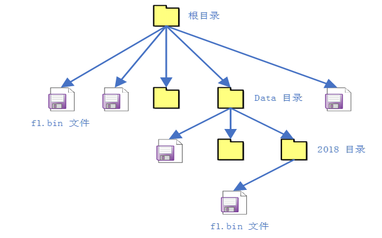

[官方文档：虚拟文件系统 (rt-thread.org)](https://www.rt-thread.org/document/site/#/rt-thread-version/rt-thread-standard/programming-manual/filesystem/filesystem)
## RT-Thread DFS简介
### DFS结构与功能
DFS 是 RT-Thread 提供的虚拟文件系统组件，全称为 Device File System，即设备虚拟文件系统，文件系统的名称使用类似 UNIX 文件、文件夹的风格，目录结构如下图所示：

在 RT-Thread DFS 中，文件系统有统一的根目录，使用 `/` 来表示。而在根目录下的 f1.bin 文件则使用 `/f1.bin` 来表示，2018 目录下的 `f1.bin` 目录则使用 `/data/2018/f1.bin` 来表示。即目录的分割符号是 `/`，这与 UNIX/Linux 完全相同，与 Windows 则不相同（Windows 操作系统上使用 `\` 来作为目录的分割符）。

RT-Thread DFS 组件的主要功能特点有：

-   为应用程序提供统一的 POSIX 文件和目录操作接口：read、write、poll/select 等。
    
-   支持多种类型的文件系统，如 FatFS、RomFS、DevFS 等，并提供普通文件、设备文件、网络文件描述符的管理。
    
-   支持多种类型的存储设备，如 SD Card、SPI Flash、Nand Flash 等。

DFS 的层次架构如下图所示，主要分为 POSIX 接口层、虚拟文件系统层和设备抽象层。


- POSIX接口层：一套API接口规范
- 虚拟文件系统层：注册具体的文件系统
- 设备抽象层：将物理设备如 SD Card、SPI Flash、Nand Flash，抽象成符合文件系统能够访问的设备，例如 FAT 文件系统要求存储设备必须是块设备类型。

### DFS运行流程
#### 初始化文件系统
文件系统的初始化过程一般分为以下几个步骤：
1. **初始化 DFS 组件：** 由 dfs_init() 函数完成。dfs_init() 函数会初始化 DFS 所需的相关资源，创建一些关键的数据结构, 有了这些数据结构，DFS 便能在系统中找到特定的文件系统，并获得对特定存储设备内文件的操作方法。
2. **初始化具体类型的文件系统：** 将具体类型的文件系统注册到 DFS 中。注册文件系统的接口如下所示：`int dfs_register(const struct dfs_filesystem_ops *ops);` 其被不同文件系统的初始化函数调用，如 elm-FAT 文件系统的初始化函数`elm_init()`。
3. **在存储器上创建块设备：** 只有块设备才可以挂载到文件系统上，因此需要在存储设备上创建所需的块设备。如果存储设备是 SPI Flash，则可以使用 “串行 Flash 通用驱动库 SFUD” 组件，它提供了各种 SPI Flash 的驱动，并将 SPI Flash 抽象成块设备用于挂载，
4. **格式化块设备：** 在块设备上创建指定类型的文件系统，也就是格式化文件系统。可以使用 `dfs_mkfs()` 函数对指定的存储设备进行格式化，创建文件系统
5. **挂载块设备到 DFS 目录中：** 在 RT-Thread 中，挂载是指将一个存储设备挂接到一个已存在的路径上。我们要访问存储设备中的文件，必须将文件所在的分区挂载到一个已存在的路径上，然后通过这个路径来访问存储设备。
6. **当文件系统不再使用，可以将它卸载**

#### 文件操作相关函数
```C
open();
close();
read();
write();
rename();
stat();    // 文件状态
unlink();  // 删除
fsync();   // 同步文件数据到存储设备
statfs();  // 查询文件系统信息
select();  // 监视I/O设备状态
```

#### 目录管理函数
```C
mkdir();
rmdir();
opendir();
readdir();
readdir();
closedir();
telldir();   // 获取目录流的读取位置
seekdir();   // 设置下次读取目录的位置
rewindder(); // 重设目录流的读取位置为开头
```

## 代码实现分析
### 初始化DFS组件
dfs_init()函数
- 声明位置：`rt-thread/components/dfs/dfs_v2/include/dfs.h` line79
- 源代码：`rt-thread/components/dfs/dfs_v2/src/dfs.c` line 48
``` C
/**

* this function will initialize device file system.

*/

int dfs_init(void)

{

static rt_bool_t init_ok = RT_FALSE;

if (init_ok)

{

rt_kprintf("dfs already init.\n");

return 0;

}

/* init vnode hash table */

dfs_vnode_mgr_init();

/* clear filesystem operations table */

rt_memset((void *)filesystem_operation_table, 0, sizeof(filesystem_operation_table));

/* clear filesystem table */

rt_memset(filesystem_table, 0, sizeof(filesystem_table));

/* clean fd table */

rt_memset(&_fdtab, 0, sizeof(_fdtab));

/* create device filesystem lock */

rt_mutex_init(&fslock, "fslock", RT_IPC_FLAG_PRIO);

rt_mutex_init(&fdlock, "fdlock", RT_IPC_FLAG_PRIO);

#ifdef DFS_USING_WORKDIR

/* set current working directory */

rt_memset(working_directory, 0, sizeof(working_directory));

working_directory[0] = '/';

#endif

#ifdef RT_USING_DFS_TMPFS

{

extern int dfs_tmpfs_init(void);

dfs_tmpfs_init();

}

#endif

#ifdef RT_USING_DFS_DEVFS

{

extern int devfs_init(void);

/* if enable devfs, initialize and mount it as soon as possible */

devfs_init();

dfs_mount(NULL, "/dev", "devfs", 0, 0);

}

#if defined(RT_USING_DEV_BUS) && defined(RT_USING_DFS_TMPFS)

mkdir("/dev/shm", 0x777);

if (dfs_mount(RT_NULL, "/dev/shm", "tmp", 0, 0) != 0)

{

rt_kprintf("Dir /dev/shm mount failed!\n");

}

#endif

#endif

init_ok = RT_TRUE;

return 0;

}

INIT_PREV_EXPORT(dfs_init);

```
大致做了几件事：
1. 清理
	1. vnode初始化
	2. 清除文件系统操作函数表
	3. 清除文件系统挂载表
	4. 清除fd table（文件描述符表）
2. 初始化
	1. 设置设备文件系统锁
	2. 创建当前工作目录
	3. 设置临时文件系统tmpfs
	4. 若选择使用devfs，则立即初始化其内容
### 注册文件系统
`dfs_register()`
- declaration: `rt-thread/components/dfs/dfs_v2/include/dfs_fs.h` line 78
- code: `rt-thread/components/dfs/dfs_v2/src/dfs_fs.c` line 31
```C
/**

* this function will register a file system instance to device file system.

*

* @param ops the file system instance to be registered.

*

* @return 0 on successful, -1 on failed.

*/

int dfs_register(const struct dfs_filesystem_ops *ops)

{

int ret = RT_EOK;

const struct dfs_filesystem_ops **empty = NULL;

const struct dfs_filesystem_ops **iter;

/* lock filesystem */

dfs_lock();

/* check if this filesystem was already registered */

for (iter = &filesystem_operation_table[0];

iter < &filesystem_operation_table[DFS_FILESYSTEM_TYPES_MAX]; iter ++)

{

/* find out an empty filesystem type entry */

if (*iter == NULL)

(empty == NULL) ? (empty = iter) : 0;

else if (strcmp((*iter)->name, ops->name) == 0)

{

rt_set_errno(-EEXIST);

ret = -1;

break;

}

}

/* save the filesystem's operations */

if (empty == NULL)

{

rt_set_errno(-ENOSPC);

LOG_E("There is no space to register this file system (%s).", ops->name);

ret = -1;

}

else if (ret == RT_EOK)

{

*empty = ops;

}

dfs_unlock();

return ret;

}
```
大致做了几件事：
1. 锁定文件系统
2. 检查是否已注册
3. 保存该文件系统的操作函数表
4. 解锁文件系统
### 存储器上注册块设备
文档中使用SFUD库组件，也就是说利用相关的存储设备接口实现对硬件进行抽象为块设备的过程。
### 格式化文件系统
dfs_mkfs
- declaration: `rt-thread/components/dfs/dfs_v2/include/dfs_fs.h` line 93
- code: `rt-thread/components/dfs/dfs_v2/src/dfs_fs.c` line 432
```C
/**

* make a file system on the special device

*

* @param fs_name the file system name

* @param device_name the special device name

*

* @return 0 on successful, otherwise failed.

*/

int dfs_mkfs(const char *fs_name, const char *device_name)

{

int index;

rt_device_t dev_id = NULL;

/* check device name, and it should not be NULL */

if (device_name != NULL)

dev_id = rt_device_find(device_name);

if (dev_id == NULL)

{

rt_set_errno(-ENODEV);

LOG_E("Device (%s) was not found", device_name);

return -1;

}

/* lock file system */

dfs_lock();

/* find the file system operations */

for (index = 0; index < DFS_FILESYSTEM_TYPES_MAX; index ++)

{

if (filesystem_operation_table[index] != NULL &&

strncmp(filesystem_operation_table[index]->name, fs_name,

strlen(filesystem_operation_table[index]->name)) == 0)

break;

}

dfs_unlock();

if (index < DFS_FILESYSTEM_TYPES_MAX)

{

/* find file system operation */

const struct dfs_filesystem_ops *ops = filesystem_operation_table[index];

if (ops->mkfs == NULL)

{

LOG_E("The file system (%s) mkfs function was not implement", fs_name);

rt_set_errno(-ENOSYS);

return -1;

}

return ops->mkfs(dev_id, fs_name);

}

LOG_E("File system (%s) was not found.", fs_name);

return -1;

}
```
大致做了几件事：
1. 检查设备是否存在
2. 锁定文件系统
3. 查找该文件系统的操作函数
4. 解锁文件系统
5. 调用该文件系统的mkfs函数
### 挂载文件系统
dfs_mount()
- declaration: `rt-thread/components/dfs/dfs_v2/include/dfs_fs.h` line 86
- code : `rt-thread/components/dfs/dfs_v2/src/dfs_fs.c` line 214
```C
int dfs_mount(const char *device_name,

const char *path,

const char *filesystemtype,

unsigned long rwflag,

const void *data)

{

const struct dfs_filesystem_ops **ops;

struct dfs_filesystem *iter;

struct dfs_filesystem *fs = NULL;

char *fullpath = NULL;

rt_device_t dev_id;

/* open specific device */

if (device_name == NULL)

{

/* which is a non-device filesystem mount */

dev_id = NULL;

}

else if ((dev_id = rt_device_find(device_name)) == NULL)

{

/* no this device */

rt_set_errno(-ENODEV);

return -1;

}

/* find out the specific filesystem */

dfs_lock();

for (ops = &filesystem_operation_table[0];

ops < &filesystem_operation_table[DFS_FILESYSTEM_TYPES_MAX]; ops++)

if ((*ops != NULL) && (strncmp((*ops)->name, filesystemtype, strlen((*ops)->name)) == 0))

break;

dfs_unlock();

if (ops == &filesystem_operation_table[DFS_FILESYSTEM_TYPES_MAX])

{

/* can't find filesystem */

rt_set_errno(-ENODEV);

return -1;

}

/* check if there is mount implementation */

if ((*ops == NULL) || ((*ops)->mount == NULL))

{

rt_set_errno(-ENOSYS);

return -1;

}

/* make full path for special file */

fullpath = dfs_normalize_path(NULL, path);

if (fullpath == NULL) /* not an abstract path */

{

rt_set_errno(-ENOTDIR);

return -1;

}

/* Check if the path exists or not, raw APIs call, fixme */

if ((strcmp(fullpath, "/") != 0) && (strcmp(fullpath, "/dev") != 0))

{

struct dfs_file fd;

fd_init(&fd);

if (dfs_file_open(&fd, fullpath, O_RDONLY | O_DIRECTORY) < 0)

{

rt_free(fullpath);

rt_set_errno(-ENOTDIR);

return -1;

}

dfs_file_close(&fd);

}

/* check whether the file system mounted or not in the filesystem table

* if it is unmounted yet, find out an empty entry */

dfs_lock();

for (iter = &filesystem_table[0];

iter < &filesystem_table[DFS_FILESYSTEMS_MAX]; iter++)

{

/* check if it is an empty filesystem table entry? if it is, save fs */

if (iter->ops == NULL)

(fs == NULL) ? (fs = iter) : 0;

/* check if the PATH is mounted */

else if (strcmp(iter->path, path) == 0)

{

rt_set_errno(-EINVAL);

goto err1;

}

}

if ((fs == NULL) && (iter == &filesystem_table[DFS_FILESYSTEMS_MAX]))

{

rt_set_errno(-ENOSPC);

LOG_E("There is no space to mount this file system (%s).", filesystemtype);

goto err1;

}

/* register file system */

fs->path = fullpath;

fs->ops = *ops;

fs->dev_id = dev_id;

/* For UFS, record the real filesystem name */

fs->data = (void *) filesystemtype;

/* release filesystem_table lock */

dfs_unlock();

/* open device, but do not check the status of device */

if (dev_id != NULL)

{

if (rt_device_open(fs->dev_id,

RT_DEVICE_OFLAG_RDWR) != RT_EOK)

{

/* The underlying device has error, clear the entry. */

dfs_lock();

rt_memset(fs, 0, sizeof(struct dfs_filesystem));

goto err1;

}

}

/* call mount of this filesystem */

if ((*ops)->mount(fs, rwflag, data) < 0)

{

/* close device */

if (dev_id != NULL)

rt_device_close(fs->dev_id);

/* mount failed */

dfs_lock();

/* clear filesystem table entry */

rt_memset(fs, 0, sizeof(struct dfs_filesystem));

goto err1;

}

return 0;

err1:

dfs_unlock();

rt_free(fullpath);

return -1;

}
```
大致做了几件事：
1. 打开指定设备：无设备挂载；有设备挂载；设备未找到
2. 查找该文件系统，即操作函数表
3. 设置文件的路径
4. 未挂载的文件系统准备空间
5. 打开设备
6. 调用文件系统自带的挂载函数
### 卸载文件系统
dfs_unmount()
- declaration: `rt-thread/components/dfs/dfs_v2/include/dfs_fs.h` line 96
- code : `rt-thread/components/dfs/dfs_v2/src/dfs_fs.c` line 367
```C
int dfs_unmount(const char *specialfile)

{

char *fullpath;

struct dfs_filesystem *iter;

struct dfs_filesystem *fs = NULL;

fullpath = dfs_normalize_path(NULL, specialfile);

if (fullpath == NULL)

{

rt_set_errno(-ENOTDIR);

return -1;

}

/* lock filesystem */

dfs_lock();

for (iter = &filesystem_table[0];

iter < &filesystem_table[DFS_FILESYSTEMS_MAX]; iter++)

{

/* check if the PATH is mounted */

if ((iter->path != NULL) && (strcmp(iter->path, fullpath) == 0))

{

fs = iter;

break;

}

}

if (fs == NULL ||

fs->ops->unmount == NULL ||

fs->ops->unmount(fs) < 0)

{

goto err1;

}

/* close device, but do not check the status of device */

if (fs->dev_id != NULL)

rt_device_close(fs->dev_id);

if (fs->path != NULL)

rt_free(fs->path);

/* clear this filesystem table entry */

rt_memset(fs, 0, sizeof(struct dfs_filesystem));

dfs_unlock();

rt_free(fullpath);

return 0;

err1:

dfs_unlock();

rt_free(fullpath);

return -1;

}
```
大致做了几件事：
1. 锁定文件系统
2. 清理相应的文件系统操作函数表、文件系统表