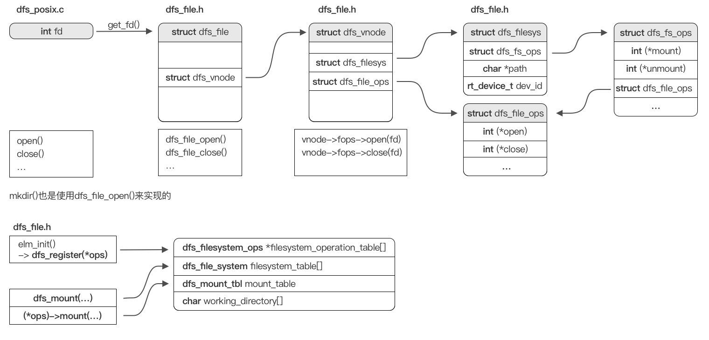

# RT-Thread DFS 设计抽象
## DFS设计解析
具体结构体存储设计、完整调用链可以参见下图。


DFS使用文件标识数 -> 文件标识符 -> 虚拟文件节点 三层架构来存储文件信息，并且完成了特定文件系统的系统操作以及文件操作的抽象组织，只需调用操作链表中相应的函数即可完成对特定文件系统的操作。

值得注意的是，DFS中并不是如想象般使用指针树来存储文件系统的目录结构，而是使用了哈希表来存储文件系统的目录结构，这样可以大大减少内存的使用，但是会增加一定的时间复杂度。这里也设置了rt_mutex类型的锁，用于保证多线程访问时的安全性。
```cpp
struct dfs_vnode_mgr
{
    struct rt_mutex lock;
    rt_list_t head[DFS_VNODE_HASH_NR];
};

static struct dfs_vnode_mgr dfs_fm;
```

## 对于此项目的帮助
可以参照此设计成熟的VFS进行实现，也可以参照此设计进行VFS的重构。
从上图可以很清楚的看出，主要VFS函数分为两部分：文件系统部分（挂载相关）、文件部分（打开相关）。

因此对于我们项目的第二步：**最小可行性实现**，可以主要分为四部分的代码实现：
* 底层某文件系统的文件相关实现 (*open)
* 底层某文件系统的系统相关实现 (*mount)
* 某几个文件操作函数实现 (dfs_file_x)
* POSIX接口实现 (posix.c)
  
对于POSIX函数的参数设计，这是确定的，可以参照POSIX标准。而对于VFS内部接口、参数、共享数据设计，需要参考FreeRTOS库提供的支持以及其与RT-Thread间的异同来进行讨论。
