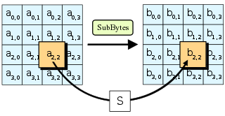
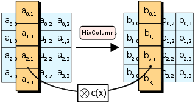

# ErisFS 结题报告

## 项目简介 
我们的项目ErisFS是FreeRTOS第一个真正意义上的虚拟文件系统。
ErisFS兼容所有Posix 文件相关API，并且可拓展性极强，可以支持多种文件系统及存储介质移植。

它将FreeRTOS与其他实时操作系统在存储管理方面的差距完全抹平；还可能与其他Posix项目联动，
极大地方便了降低了UNIX-like程序移植到FreeRTOS上的难度，激发了嵌入式系统的无限潜能。

支持的File Posix API: 

* open, close, read, write, rename, unlink, stat, fstat, creat, lseek, ftruncate ...
* mount, unmount, mkfs, statfs ...

支持的底层文件系统: 
* ramFS
* FATFS
* 更多待移植


## 项目背景
近年来，物联网设备数量逐年增长，同时嵌入式设备平均所有的存储空间也在逐年增长。最初的嵌入式设备仅需采用向指定地址写入即可简单地管理数据，但随着存储容量的增加，这种方式的劣势不断凸显，对文件系统的需求也日益急迫。FreeRTOS作为嵌入式设备的领军项目，一直缺少一个易用全面的虚拟文件系统模块，这使得FreeRTOS无法胜任许多应用场景，与同类操作系统的差距日益明显。因此，我们希望通过开发一个虚拟文件系统来解决这个问题。

## 项目架构


上两张图分别是ErisFS的总体架构以及核心部分的详细架构图，可以从中窥探到ErisFS的设计理念。

当用户使用时，会先调用**Posix标准层**的Posix标准函数（open, close, read, write...），然后由**EFS虚拟层**的对应EFS函数查找到打开的文件标识符（efs_file，存储了文件基础信息），再调用**基础文件系统层**的对应操作对虚拟文件节点进行读写，最终在最底下的**存储介质读写层**这里调用具体的驱动进行介质读写。

当添加新的文件系统时，需要为其每个操作函数编写一个适配层（用于转换函数参数格式等使得其匹配ErisFS）；添加新的底层读写介质时，需要添加硬件厂商提供的硬件驱动（一般是编写好的读写函数等）；相对于完全和FATFS锁定的FreeRTOS-Plus-FAT来说，ErisFS拥有无可比拟的可拓展性以及易拓展性。

在我们的开发过程中，我们实现了ramFS，FATFS的移植，以及SD的驱动移植。选取ramFS的主要原因是其原理简单，易于实现，无需涉及硬件（直接在RAM中读写），因此在项目初期采用适合快速开发最小可行性版本，调试上层函数逻辑正确性。而移植FATFS则是在项目核心开发完成后，为了展现项目的实际意义所选取的一个较为实用的文件系统，并且选择了SD卡作为存储介质，这一部分的移植涉及较多硬件，虽然调试过程艰辛复杂，但是大幅增加了项目的实际可用性。

## 开发过程
### 第一阶段 最小可行性系统
此阶段计划为 FreeRTOS 实现最小可用的虚拟文件系统，仅支持磁盘的挂载与文件的读写操作、ramFS等。但是将完整地按照三层架构设计进行开发，方便后期拓展。
#### efs.h
其中的 ```efs_fdtable``` 表存储目前ErisFS中所有打开的文件标识符实体的信息以及与int类型的文件标识符的对应关系。

#### efs.c
实现有关efs内部的一些实用函数，例如文件路径的标准化处理，以及文件标识符的分配管理等，主要被其他文件调用。

例如：
* fd_new()：创建新的文件标识符实体
* fd_get()：根据int类型的文件标识符找到对应的文件标识符实体（有一些基础信息，指向虚拟文件节点）
* efs_init(): 初始化整个ErisFS的存储结构
* efs_normalize_path(): 转换地址，主要处理 . ..


#### efs_file.h

##### container_of

```C
#define container_of(ptr, type, member) \
    ((type *) ((char *) (ptr) - (unsigned long) (&((type *)0)->member)))
```

宏定义了一个容器结构体，返回输入结构体的起始地址。

##### efs_file_ops

```C
struct efs_file_ops
{
    int (* open)     (struct efs_file * fd);
    int (* close)    (struct efs_file * fd);
    int (* ioctl)    (struct efs_file * fd, int cmd, void * args);
    int (* read)     (struct efs_file * fd, void * buf, size_t count);
    int (* write)    (struct efs_file * fd, const void * buf, size_t count);
    int (* flush)    (struct efs_file * fd);
    int (* lseek)    (struct efs_file * fd, off_t offset);
    int (* getdents) (struct efs_file * fd, struct dirent * dirp, uint32_t count);
};
```

文件操作结构体，其中包含打开文件，关闭文件，读取文件，写文件等文件操作。

##### struct efs_vnode

```C
struct efs_vnode
{
    uint16_t type;                      /* Type (regular or socket) */

    char * path;                        /* Name (below mount point) */
    char * fullpath;                    /* Full path is hash key */
    int ref_count;                      /* Descriptor reference count */
    eris_list_t list;                  	/* The node of vnode hash table */

    struct efs_filesystem * fs;         /* File system */
    const struct efs_file_ops * fops;   /* File operations */
    uint32_t flags;                     /* self flags, is dir etc.. */

    size_t size;                        /* Size in bytes */
    void * data;                        /* Specific file system data */
};
```

文件结点结构体，包括文件类型，路径，哈希表，文件系统，文件操作等成员。

##### efs_mmap2_args

```C
struct efs_mmap2_args
{
    void * addr;        /* User address */
    size_t length;      /* Length of mapping */
    int prot;           /* Mapping protection */
    int flags;          /* Mapping flags */
    off_t pgoffset;     /* Offset to page boundary */
    void * ret;         /* Return value */
};
```

文件地址映射表结构体，包括了用户地址，映射长度，保护等级，映射标识符等。

#### efs_file.c

##### 信号量的传递

```C
void efs_fm_lock(void) 
{
    xSemaphoreTake( efs_fm.mutex, portMAX_DELAY);
}

void efs_fm_unlock(void) 
{
    xSemaphoreGive( efs_fm.mutex);
}
```


这段代码定义了两个函数：`efs_fm_lock`和`efs_fm_unlock`，用于对文件管理器进行加锁和解锁操作。

- `efs_fm_lock`函数用于获取文件管理器的互斥信号量（`efs_fm.mutex`）。互斥信号量是一种同步机制，它用于确保在同一时间只有一个线程可以进入被保护的代码段。通过调用`xSemaphoreTake`函数，并传入`efs_fm.mutex`和`portMAX_DELAY`参数，该函数将会一直等待，直到成功获取互斥信号量，即其他线程释放了该信号量。
- `efs_fm_unlock`函数用于释放文件管理器的互斥信号量（`efs_fm.mutex`）。通过调用`xSemaphoreGive`函数，并传入`efs_fm.mutex`参数，该函数会释放互斥信号量，允许其他线程获取该信号量。

这两个函数在文件管理器的代码中起到了加锁和解锁的作用，以确保在关键的文件操作期间，只有一个线程可以访问文件管理器的相关资源，避免并发访问导致的数据竞争和不一致性。

##### 始化文件节点管理器

```C
void efs_vnode_mgr_init(void)
{
    int i = 0; 
    efs_fm.mutex = xSemaphoreCreateMutex();
    for (i = 0; i < EFS_FNODE_HASH_NR; i++)
    {
        eris_list_init(&efs_fm.head[i]);
    }
}
```

这段代码定义了一个名为`efs_vnode_mgr_init`的函数，用于初始化文件节点管理器。

- 首先，定义了一个整型变量 `i` 并初始化为 0。
- 接下来，通过调用 `xSemaphoreCreateMutex()` 函数创建了一个互斥信号量，并将其赋值给文件管理器的 `efs_fm.mutex` 成员。
- 然后，通过一个 `for` 循环遍历索引 `i` 从 0 到 `EFS_FNODE_HASH_NR`（一个常量），对于每个索引值，调用 `eris_list_init()` 函数来初始化 `efs_fm.head` 数组中对应索引位置的链表。

该函数的目的是初始化文件节点管理器，它执行以下操作：

- 创建一个互斥信号量，用于对文件管理器进行加锁和解锁。
- 初始化文件管理器的 `head` 数组，这是一个包含多个链表的数组，用于存储文件节点的哈希表。

通过这些初始化操作，文件节点管理器被准备好，可以在后续的文件系统操作中使用。

##### 计算字符串的哈希值

```C
static unsigned int bkdr_hash(const char * str)
{
    unsigned int seed = 131; // 31 131 1313 13131 131313 etc..
    unsigned int hash = 0;

    while (* str)
    {
        hash = hash * seed + (*str++);
    }

    return (hash % EFS_FNODE_HASH_NR);
}
```

这段代码定义了一个静态函数 `bkdr_hash`，用于计算字符串的哈希值。

- 首先，定义了一个无符号整型变量 `seed` 并初始化为 131，这是一个经验值常用于哈希函数。
- 接下来，定义了另一个无符号整型变量 `hash` 并初始化为 0，用于保存计算得到的哈希值。
- 在一个 `while` 循环中，通过迭代字符串 `str` 的每个字符进行计算。
  - 在每次循环中，将当前字符的 ASCII 值与哈希值相乘，并加上哈希值本身。
  - 使用后置递增运算符 `(*str++)` 来迭代到下一个字符。
- 最后，通过取哈希值 `hash` 对 `EFS_FNODE_HASH_NR`（一个常量）取模来得到最终的哈希值。

该哈希函数采用了BKDR（Bai, Kernighan, Driscoll, Roberts）哈希算法，它是一种简单且高效的哈希算法。它通过对字符串中的每个字符进行乘法和加法操作，以生成一个唯一的哈希值。在该函数中，使用的乘数 `seed` 可以根据实际需求进行调整。

最终的哈希值被用于将字符串映射到哈希表的索引位置，以便进行快速的查找和访问操作。

##### 文件操作

```C
void efs_vnode_mgr_init(void);
int efs_file_open(struct efs_file * fd, const char * path, int flags);
int efs_file_close(struct efs_file * fd);
int efs_file_read(struct efs_file * fd, void * buf, size_t len);
int efs_file_getdents(struct efs_file *fd, struct dirent *dirp, size_t nbytes);
int efs_file_unlink(const char *path);
int efs_file_write(struct efs_file * fd, const void * buf, size_t len);
off_t efs_file_lseek(struct efs_file *fd, off_t offset);
int efs_file_stat(const char *path, struct stat_efs *buf);
int efs_file_rename(const char *old_path, const char *new_path);
int efs_file_ftruncate(struct efs_file *fd, off_t length);
```

文件操作包括打开文件，关闭文件，读取文件，写文件，获取目录项 getdents，删除文件，偏移定位操作，获取文件信息，文件重命名，截断文件长度操作。

以 efs_file_ftruncate 函数为例：

```C
int efs_file_ftruncate(struct efs_file *fd, off_t length)
{
    int result;

    if (fd == NULL || fd->vnode->type != FT_REGULAR || length < 0) 
    {
        // printf("[efs_file.c] efs_file_ftruncate: fd is NULL or not a regular file system fd\r\n");
        return -EINVAL;
    }

    if (fd->vnode->fops->ioctl == NULL)
        return -ENOSYS;

    result = fd->vnode->fops->ioctl(fd, EFS_FIOFTRUNCATE, (void*)&length); 
    // TO BE CHECKED

    if (result == 0)
        fd->vnode->size = length;

    return result;
}
```

- 首先，定义了一个整型变量 `result`。
- 接下来，进行参数检查，判断传入的文件描述符 `fd` 是否为 NULL、文件节点的类型是否为普通文件（`FT_REGULAR`）以及截断长度 `length` 是否小于 0。如果满足其中任何一个条件，返回 -EINVAL 表示参数无效。
- 然后，检查文件节点的文件操作函数指针 `fd->vnode->fops->ioctl` 是否为 NULL。如果为 NULL，说明不支持 ioctl 操作，返回 -ENOSYS 表示不支持的系统调用。
- 接着，调用文件操作函数指针 `fd->vnode->fops->ioctl`，传入文件描述符 `fd`、操作标识符 `EFS_FIOFTRUNCATE` 和长度指针的地址 `(void*)&length` 来执行截断操作。将结果保存在 `result` 变量中。
- 如果截断操作成功（返回值为 0），则更新文件节点的大小 `fd->vnode->size` 为给定的长度 `length`。
- 最后，返回截断操作的结果 `result`。

该函数用于截断文件的长度，通过调用文件描述符所关联的文件节点的文件操作函数中的 ioctl 函数来执行具体的截断操作。它根据传入的参数进行验证，并根据操作结果更新文件节点的大小。

#### efs_fs.c[lyb]
efs_fs的作用是对文件系统进行管理，功能包括文件系统的挂载卸载、查找路径上的文件系统、查找设备上的文件系统、对文件系统状态进行控制，以下先介绍相关结构体的功能：
- `struct efs_filesystem_ops`：文件系统操作表，保存文件系统名及其操作函数，包括文件系统名、文件系统对文件操作的函数表`const struct efs_file_ops *fops`以及文件系统操作函数，如mount、unmount等
- `struct efs_filesystem`：已挂载的文件系统表 保存文件系统与设备、路径等信息
- `struct efs_partition`：文件系统分区表 文件系统分配空间信息包括文件系统类型、分区大小等
- `struct efs_mount_tbl`：文件系统挂载表 对设备、路径、文件系统的总管理，包括设备名、路径、文件系统类型等

通过上述结构体，文件系统的各项操作（一般由文件系统自身实现）、文件系统使用的硬件空间、设备、路径等信息都完备地实现了记录。实现挂载等功能时只需对相关更底层的函数调用或是对信息进行处理。efs_fs.c中的函数实质上是对各种结构体的完善或控制。
- `efs_register`：注册文件系统，保存文件系统名及其操作函数到`filesystem_operation_table`
- `efs_mount`：挂载文件系统，将文件系统与设备、路径相联系
- `efs_unmount`：卸载文件系统，清空文件系统操作表、路径、关闭设备
- `efs_mkfs`：格式化文件系统，需要调用文件系统的mkfs函数
- `efs_statfs`：获取文件系统信息，需要调用文件系统的statfs函数
- `efs_filesystem_lookup`：查找路径上的文件系统
- `efs_filesystem_get_mounted_path`：查找设备上挂载的文件系统等
- `efs_filesystem_get_partition`：获取分区表

#### efs_Posix.c[wcx]
第一阶段efs_Posix.c主要包含open,read,write,close几个最基础的函数，通过调用文件结点和efs_file.c中的对应操作完成上层的封装和有效条件的判断。

open主要操作为通过fd_new创建一个文件结点，然后使用fd_get获取创建的的文件结点，然后调用efs_file_open进行文件的创建，同时完成该文件对应文件系统的挂载；read,write,close通过fd_get获取对应文件结点，然后调用efs_file中对应的函数进行处理。

```c
int efs_open(const char *file, int flags, ...)
{
    int fd, result;
    struct efs_file *d;
    /* allocate a fd */
    fd = fd_new();
    if (fd < 0)
    {
        printf("[efs_Posix.c]failed to open a file in efs_Posix_fd_new!\n");
        return -1;
    }
    d = fd_get(fd);
    result = efs_file_open(d, file, flags);
    if (result < 0)
    {
        fd_release(fd);
        printf("[efs_Posix.c]failed to open a file in efs_Posix_efs_file_open!\n");

        return -1;
    }

    return fd;
}
```

除此之外efs_Posix.c中还对函数返回值进行了最终的判断和报错提示，即fd_get是否找到有效结点和efs_file对应函数是否进行正确的操作。
#### ramFS[lrs]

#### 最小可行性测试结果


可以看到文件开关，读写功能均测试通过，最小可行性系统基本开发完成。这个最小可行性测试完成后，我们的项目实际上已经完成了一半，得到了一个规范的三层架构虚拟文件系统
虽然目前只支持读写，但是接下来只要添加和移植而不是从零创造，难度小了很多。

### 第二阶段 Posix标准完善
在这一步中，主要进行对Posix标准层以及VFS虚拟层相应函数进行拓展，计划实现全部的Posix文件标准中的函数；同时编写了负责设备管理的device.c为第三阶段实际读写物理存储介质作准备。

#### Posix 补充[wcx]


上图展现了Posix 文件相关操作的全部函数，在第一阶段仅仅实现了前四个，本阶段计划实现剩下的全部函数（以及不在此图中的文件系统相关函数unmount, mkfs...等）。

Posix扩展主要是根据Posix标准，补全了一些关于文件和文件夹的函数，如lseek, rename, unlink, stat, fstat, statfs等文件操作和mkdir, rmdir, opendir, readdir, telldir, seekdir, rewinddir, closedir等文件夹操作。

其中，文件操作的实现和read,write这些基本操作类似；而文件夹操作其实也是一种特殊的文件操作，但是在细节处理时有所区别，通过数据结构和向efs_file对应函数传入不同参数实现，以mkdir为例，以下为其代码。

```c
int mkdir(const char *path, mode_t mode)
{
    int fd;
    struct efs_file *d;
    int result;

    fd = fd_new();
    if (fd == -1)
    {
        printf("[efs_Posix.c]failed to get the file in efs_Posix_mkdir!\n");

        return -1;
    }

    d = fd_get(fd);
    result = efs_file_open(d, path, O_DIRECTORY | O_CREAT);

    if (result < 0)
    {
        fd_release(fd);
        printf("[efs_Posix.c]failed to create directory in mkdir!\n");
        return -1;
    }

    efs_file_close(d);
    fd_release(fd);

    return 0;
}
```
#### device.c[lyb]
本项目设计中ErisFS不止局限于对单一设备的控制，而是能够对多个设备，如SD卡、Flash等进行统一的控制管理，但由于硬件限制，并未测试device管理对设备的实际效果，以下对device管理做简要介绍：
`struct efs_device`：保存设备状态及相关操作函数，包括设备开关信息、设备ID、设备接口，如init、open、close等
`efs_device_open/close`：开关设备检查设备信息，并开关设备
`efs_device_read/write`：读写设备 检查设备信息，并读写设备
`efs_device_find`：查找设备 查找已实现的设备，并返回其结构体

值得提出的是，device管理的核心是将底层的设备操作函数与上层抽象层链接以方便管理，理想状态下能够同时实现对板子上SD卡、Falsh等存储设备的统一管理。

### 第三阶段
此阶段计划为为ErisFS添加底层文件系统。得益于规范的多层架构设计，不需要改动上两层代码即可为更多的底层文件系统添加支持。

同时这一阶段为了能读写实体SD卡，选择了向STM32F429开发板进行移植，完成了许多硬件调试工作。

#### FATFS 移植
FATFS适配层主要实现了vfs虚拟层调用函数和FATFS的基本函数之间传入参数的适配，并且通过FreeRTOS中特有的空间分配释放等函数，为FATFS进行空间的分配。

其中，又分为文件系统操作函数和文件操作函数，文件系统操作函数包括efs_fatfs_mount, efs_fatfs_unmount，efs_fatfs_mkfs,efs_fatfs_statfs,efs_fatfs_unlink,efs_fatfs_stat, efs_fatfs_rename；文件操作函数包括efs_fatfs_open, efs_fatfs_close, efs_fatfs_ioctl, efs_fatfs_read, efs_fatfs_write, efs_fatfs_lseek, efs_fatfs_getdents。

大致函数内容如下所示，通过get_disk获取设备编号，然后通过调用FATFS内置的函数进行取消挂载的操作，其他函数还涉及部分文件系统挂载、文件夹创建等涉及到的空间分配的函数。

```c
int efs_fatfs_unmount(struct efs_filesystem *fs)
{
    FATFS *fat;
    FRESULT result;
    int  index;
    char logic_nbr[3] = {'0',':', 0};

    fat = (FATFS *)fs->data;

    if (fat == NULL)
    {
        // printf("[efs_fatfs.c] failed to fetch fat in efs_fatfs_unmount!\r\n");
        return -1;
    }

    /* find the device index and then umount it */
    index = get_disk(fs->dev_id);
    if (index == -1) /* not found */
    {
        // printf("[efs_fatfs.c] failed to get disk in efs_fatfs_unmount!\r\n");
        return -1;
    }

    logic_nbr[0] = '0' + index;
    result = f_mount(NULL, logic_nbr, (unsigned char)0);
    if (result != FR_OK)
        return fatfs_result_to_errno(result);

    fs->data = NULL;
    disk[index] = NULL;
    vPortFree(fat);

    return 0;
}
```
#### 硬件移植[lrs]

#### 测试结果


第二阶段新增的各种Posix函数也已在硬件上测试通过，这里除了原来的测试之外，还加入了文件夹创建关闭删除等测试。

至此，我们的ErisFS已经算是开发完成了，它已经实现了我们在项目简介里提出的所有目标，支持全部FILE POSIX API，有便于修改拓展移植的三层架构，适配好了ramfs（测试意义）和FATFS（实际意义）这两个开箱即用的文件系统。

### 第四阶段

#### 经典加密[hty]

**凯撒密码**（英语：Caesar cipher），或称**凯撒加密**、**凯撒变换**、**变换加密**，是一种最简单且最广为人知的加密技术。凯撒密码是一种[替换加密](https://zh.wikipedia.org/wiki/替换式密码)技术，[明文](https://zh.wikipedia.org/wiki/明文)中的所有字母都在[字母表](https://zh.wikipedia.org/wiki/字母表)上向后（或向前）按照一个固定数目进行偏移后被替换成[密文](https://zh.wikipedia.org/wiki/密文)。例如，当偏移量是3的时候，所有的字母A将被替换成D，B变成E，以此类推。这个加密方法是以[罗马共和](https://zh.wikipedia.org/wiki/羅馬共和)时期[凯撒](https://zh.wikipedia.org/wiki/凱撒)的名字命名的，据称当年凯撒曾用此方法与其将军们进行联系。

凯撒密码通常被作为其他更复杂的加密方法中的一个步骤，例如[维吉尼亚密码](https://zh.wikipedia.org/wiki/维吉尼亚密码)。凯撒密码还在现代的[ROT13](https://zh.wikipedia.org/wiki/ROT13)系统中被应用。但是和所有的利用字母表进行替换的加密技术一样，凯撒密码非常容易被破解，而且在实际应用中也无法保证通信安全。

凯撒密码的加密、解密方法还能够通过[同余](https://zh.wikipedia.org/wiki/同余)的数学方法进行计算。首先将字母用数字代替，A=0，B=1，...，Z=25。此时偏移量为n的加密方法即为：
$$
E_n(x)=(x+n)\ mod\ 26
$$
解密就是：
$$
D_n(x)=(x-n)\ mod\ 26
$$

#### AES加密[hty]

**高级加密标准**（英语：**A**dvanced **E**ncryption **S**tandard，[缩写](https://zh.wikipedia.org/wiki/缩写)：AES），又称**Rijndael加密法**（荷兰语发音：[[ˈrɛindaːl\]](https://zh.wikipedia.org/wiki/Help:荷蘭語國際音標)，音似英文的“Rhine doll”），是[美国联邦政府](https://zh.wikipedia.org/wiki/美国联邦政府)采用的一种[区块加密](https://zh.wikipedia.org/wiki/區塊加密)标准。这个标准用来替代原先的[DES](https://zh.wikipedia.org/wiki/DES)，已经被多方分析且广为全世界所使用。经过五年的甄选流程，高级加密标准由[美国国家标准与技术研究院](https://zh.wikipedia.org/wiki/美国国家标准与技术研究院)（NIST）于2001年11月26日发布于FIPS PUB 197，并在2002年5月26日成为有效的标准。现在，高级加密标准已然成为[对称密钥加密](https://zh.wikipedia.org/wiki/对称密钥加密)中最流行的[算法](https://zh.wikipedia.org/wiki/演算法)之一。

该算法为[比利时](https://zh.wikipedia.org/wiki/比利时)密码学家Joan Daemen和Vincent Rijmen所设计，结合两位作者的名字，以Rijndael为名投稿高级加密标准的甄选流程。

严格地说，AES和[Rijndael](https://zh.wikipedia.org/wiki/Rijndael)加密法并不完全一样（虽然在实际应用中两者可以互换），因为Rijndael加密法可以支持更大范围的[区块](https://zh.wikipedia.org/wiki/块大小)和[密钥长度](https://zh.wikipedia.org/wiki/密钥长度)：AES的区块长度固定为128[比特](https://zh.wikipedia.org/wiki/位元)，密钥长度则可以是128，192或256比特；而Rijndael使用的密钥和区块长度均可以是128，192或256比特。加密过程中使用的密钥是由[Rijndael密钥生成方案](https://zh.wikipedia.org/wiki/Rijndael密钥生成方案)产生。

大多数AES计算是在一个特别的[有限域](https://zh.wikipedia.org/wiki/有限域)完成的。

AES加密过程是在一个4×4的[字节](https://zh.wikipedia.org/wiki/位元组)矩阵上运作，这个矩阵又称为“体（state）”，其初值就是一个明文区块（矩阵中一个元素大小就是明文区块中的一个Byte）。（Rijndael加密法因支持更大的区块，其矩阵的“列数（Row number）”可视情况增加）加密时，各轮AES加密循环（除最后一轮外）均包含4个步骤：

1. `AddRoundKey`—[矩阵](https://zh.wikipedia.org/wiki/矩阵)中的每一个字节都与该次[回合密钥](https://zh.wikipedia.org/w/index.php?title=密鑰次序表&action=edit&redlink=1)（round key）做[XOR运算](https://zh.wikipedia.org/zh-cn/XOR)；每个子密钥由密钥生成方案产生。
2. `SubBytes`—透过一个非线性的替换函数，用[查找表](https://zh.wikipedia.org/wiki/查找表)的方式把每个字节替换成对应的字节。
3. `ShiftRows`—将矩阵中的每个横列进行循环式移位。
4. `MixColumns`—为了充分混合矩阵中各个直行的操作。这个步骤使用线性转换来混合每内联的四个字节。最后一个加密循环中省略`MixColumns`步骤，而以另一个`AddRoundKey`取代。

##### AddRoundKey

`AddRoundKey`步骤，回合密钥将会与原矩阵合并。在每次的加密循环中，都会由主密钥产生一把回合密钥（透过[Rijndael密钥生成方案](https://zh.wikipedia.org/wiki/Rijndael密钥生成方案)产生），这把密钥大小会跟原矩阵一样，以与原矩阵中每个对应的字节作[异或](https://zh.wikipedia.org/wiki/异或)（⊕）加法。


```C
/**
 *  Cipher() AES encrypt function
 *  Input: in[16] plaintext block(128 bits), NR (Number of round), key[]
 *  output: out[16] cipher block(128 bits), 
 */
void AddRoundKey(int round)
{
    /**
     * first key index = round * 16 bytes = round * NB * 4;
     * NB = 4
     */
    for (int i = 0; i < 4; i++)
    {
        for (int j = 0; j < 4; j++)
        {
            state[j][i] ^= round_key[(i * NB + j) + (round * NB * 4)]; 
        }
    }
    return;
}
```

##### SubBytes

在`SubBytes`步骤中，矩阵中的各字节透过一个8位的[S-box](https://zh.wikipedia.org/wiki/S-box)进行转换。这个步骤提供了[加密法](https://zh.wikipedia.org/wiki/加密法)非线性的变换能力。[S-box](https://zh.wikipedia.org/wiki/S-box)与$GF(2^8)$上的乘法[反元素](https://zh.wikipedia.org/wiki/反元素)有关，已知具有良好的[非线性](https://zh.wikipedia.org/wiki/非線性)特性。为了避免简单代数性质的攻击，S-box结合了乘法反元素及一个可逆的[仿射变换](https://zh.wikipedia.org/wiki/仿射变换)矩阵建构而成。此外在建构S-box时，刻意避开了[不动点](https://zh.wikipedia.org/wiki/不動點)与[反不动点](https://zh.wikipedia.org/w/index.php?title=反不動點&action=edit&redlink=1)，即以S-box替换字节的结果会相当于错排的结果。



```C
// S-Box Substitution
void SubBytes(void)
{
    for (int i = 0; i < 4; i++)
    {
        for (int j = 0;j < 4;j++)
        {
            state[i][j] = substitution_box[state[i][j]];
        }
    }
    return;
}
```

##### ShiftRows

`ShiftRows`描述矩阵的行操作。在此步骤中，每一行都向左循环位移某个[偏移量](https://zh.wikipedia.org/wiki/偏移量)。在AES中（区块大小128位），第一行维持不变，第二行里的每个字节都向左循环移动一格。同理，第三行及第四行向左循环位移的偏移量就分别是2和3。128位和192比特的区块在此步骤的循环位移的模式相同。经过`ShiftRows`之后，矩阵中每一竖列，都是由输入矩阵中的每个不同列中的元素组成。Rijndael算法的版本中，偏移量和AES有少许不同；对于长度256比特的区块，第一行仍然维持不变，第二行、第三行、第四行的偏移量分别是1字节、2字节、3字节。除此之外，`ShiftRows`操作步骤在Rijndael和AES中完全相同。


```C
// left Circular Shift (row), 
void ShiftRows(void)
{
    unsigned char temp_byte;
    
    // 2nd row left Circular Shift 1 byte
    temp_byte   = state[1][0];
    state[1][0] = state[1][1];
    state[1][1] = state[1][2];
    state[1][2] = state[1][3];
    state[1][3] = temp_byte;

    // 3th row left Circular Shift 2 byte
    temp_byte   = state[2][0];
    state[2][0] = state[2][2];
    state[2][2] = temp_byte;

    temp_byte    = state[2][1];
    state[2][1] = state[2][3];
    state[2][3] = temp_byte;

    // 4th row left Circular Shift 3 byte
    temp_byte   = state[3][0];
    state[3][0] = state[3][3];
    state[3][3] = state[3][2];
    state[3][2] = state[3][1];
    state[3][1] = temp_byte;
    return;
}
```

##### MixColumns

在`MixColumns`步骤，每一列的四个字节透过[线性变换](https://zh.wikipedia.org/wiki/线性变换)互相结合。每一列的四个元素分别当作$1,x,x^2,x^3$的系数，合并即为$GF(2^8)$中的一个多项式，接着将此多项式和一个固定的多项式在$c(x)=3x^3+x^2+x+2$模$x^4+1$下相乘。此步骤亦可视为[Rijndael有限域](https://zh.wikipedia.org/w/index.php?title=Rijndael有限域&action=edit&redlink=1)之下的矩阵乘法。`MixColumns`函数接受4个字节的输入，输出4个字节，每一个输入的字节都会对输出的四个字节造成影响。因此`ShiftRows`和`MixColumns`两步骤为这个密码系统提供了[扩散性](https://zh.wikipedia.org/w/index.php?title=擴散性&action=edit&redlink=1)。



```C
/** 
 *  MixColumns()
 *  4 sub_block) 
 *  c0     [2 3 1 1   [b0  
 *  c1      1 2 3 1    b1
 *  c2  =   1 1 2 3    b2
 *  c3      3 1 1 2]   b3]
 *  linear transform
 */
void MixColumns(void)
{
    unsigned char Tmp, Tm, t;
    for(int i = 0; i < 4; i++)
    {    
        t   = state[0][i];
        Tmp = state[0][i] ^ state[1][i] ^ state[2][i] ^ state[3][i];
        Tm  = state[0][i] ^ state[1][i]; 
        Tm = xtime(Tm); 
        state[0][i] ^= Tm ^ Tmp ;
        Tm  = state[1][i] ^ state[2][i]; 
        Tm = xtime(Tm); state[1][i] ^= Tm ^ Tmp ;
        Tm  = state[2][i] ^ state[3][i]; 
        Tm = xtime(Tm); state[2][i] ^= Tm ^ Tmp ;
        Tm  = state[3][i] ^ t;           
        Tm = xtime(Tm); state[3][i] ^= Tm ^ Tmp ;
    }
    return;
}
```

## 项目总结
我们的项目顺利按照开发路线完成了开发，其实现了中期报告中的所有目标。

最后实现了架构科学，接口全面，方便拓展的虚拟文件系统ErisFS，弥补了FreeRTOS在虚拟文件系统方面的短板。

它还可与其他项目联动发挥更大的作用，例如与FreeRTOS-Plus-POSIX联动便捷unix-like程序到FreeRTOS上的移植；或是与FreeRTOS-Plus-TCP联动实现嵌入式芯片即可管理的NAS服务器。总之，它大大地拓宽了FreeRTOS的应用广度与可能性，希望它能为FreeRTOS生态圈的发展做出一点贡献。


### 对比中期汇报
#### 性能测试/缓存？
关于这两点有关性能的问题，我们对此项目（虚拟文件系统）的定位进行了思考，它实际上更像是一个管理系统而非具体的文件系统。文件读写的效率不取决于我们，而取决于底层所用的文件系统格式以及下方的存储介质技术。同理，缓存技术的采用应该由底层文件系统实现，而不是我们的项目。

因此性能测试对我们的项目没有意义，确保全部功能的正确性即可，而这已在前面的三个阶段测试已经展现过了。

#### MMU？
在开题报告时邢凯老师曾提过MMU，在最后的拓展阶段我们也想到了这个方向，但是没有选择它的具体原因有三点：

* 第一点是最后选择的硬件板子本身芯片STM32F429就不支持MMU，因此软件层面即使实现了也没有意义
* 第二点是，在存储容量增长的现在，大部分嵌入式设备的运行内存依然很少，这是他们和PC的CPU之间的重大区别。MMU不被认为是实时操作系统的必需功能。实际上，作为专注精简的文件系统，FreeRTOS官方也认为不需要实现MMU繁杂的功能；同类型的RT-Thread其基础版本中也没有MMU的身影。

* 第三点，也是最基础的，我们的项目是涉及存储，而非内存管理，因此MMU和我们的方向差距过远，不予考虑


### 分工致谢
* 吴书让：ErisFS 主文件相关、测试程序编写、整体调试工作

* 李润时：RamFS、FATFS相关、硬件调试工作

* 罗胤玻：ErisFS 文件系统相关、device设备管理

* 万宸希：ErisFS POSIX 相关

* 胡天羽：加密、辅助函数相关

非常感谢各位同学在项目开发过程的全力支持，特别是考完后最近几天在开发调试上投入的大量时间、也很感谢项目过程中助教给出的许多实用建议.

最后，非常感谢邢凯老师从开题报告开始到最后硬件调试这几个月来的对我们的各种建议和设备经费支持，帮助我们更好的完成了这个项目

以上就是我们组x-Eris大作业结题报告。


