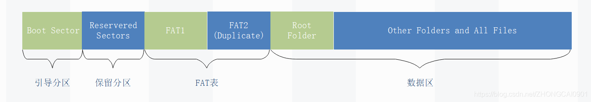
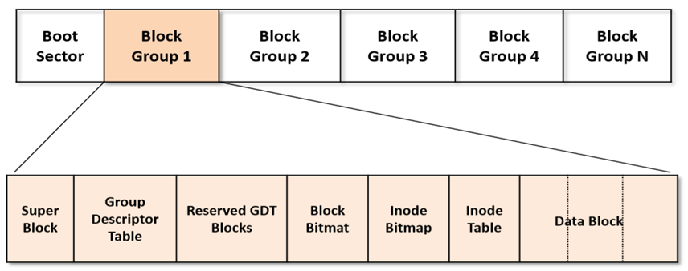
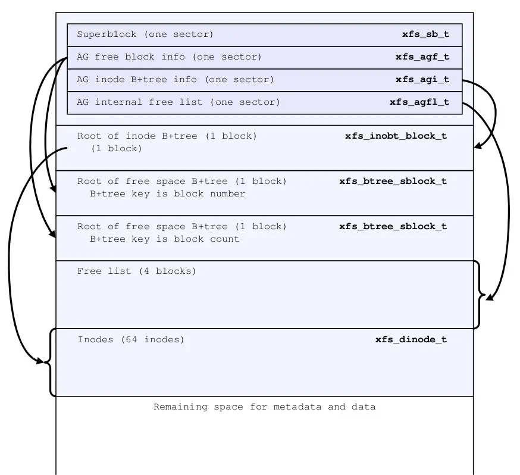
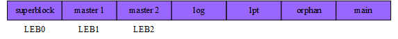

#文件系统
操作系统中负责管理和存储文件信息的软件机构称为文件管理系统，简称文件系统。文件系统是操作系统用于明确存储设备（常见的是磁盘，也有基于NAND Flash的固态硬盘）或分区上的文件的方法和数据结构；即在存储设备上组织文件的方法。文件系统由三部分组成：文件系统的接口，对对象操纵和管理的软件集合，对象及属性。
##文件系统分类
文件系统类型可分为磁盘/磁带文件系统、网络文件系统和专用文件系统。
###磁盘文件系统
磁盘文件系统是一种设计用来利用数据存储设备来保存计算机文件的文件系统，最常用的数据存储设备是磁盘驱动器，可以直接或者间接地连接到计算机上
####FATFS
 FATFS是一个完全免费开源的FAT 文件系统模块，专门为小型的嵌入式系统而设计。完全用标准C 语言编写，所以具有良好的硬件平台独立性。它支持FATl2、FATl6 和FAT32，支持多个存储媒介；有独立的缓冲区，可以对多个文件进行读／写，并特别对8 位单片机和16 位单片机做了优化。
#####存储结构
  

| 组织 | 描述 |
| :------: | :------|
| Boot Sector | 引导扇区：包含BIOS参数块，该参数块存储有关卷布局和文件系统结构的信息，以及加载Windows 的引导代码。  |
| Reserved Sectors |  保留扇区：在第一个FAT开始之前的扇区数量，包括引导扇区。 |
| FAT 1 |  原始FAT表 |
| FAT 2 |  FAT表的备份 |
| Root folder  |  描述根目录分区中的文件和文件夹 |
| Other folders and all files  |  包含文件系统中文件和文件夹的数据。 |

####ext4
第四代扩展文件系统（ext4）是Linux系统下的日志文件系统，ext4 使用 48 位的内部寻址，理论上可以在文件系统上分配高达 16 TiB 大小的文件。在早期 ext4 的实现中有些用户空间的程序仍然将其限制为最大大小为 16 TiB 的文件系统，但截至 2011 年，e2fsprogs 已经直接支持大于 16 TiB 大小的 ext4 文件系统。
#####存储结构
Ext4文件系统把整个分区划分成各个block group（块组），每个block group由superblock(超级块)，block group(区块群组)， block bitmap(区块对照表)， inode bitmap(inode 对照表)和group descriptor以及inode table、data block组成。
  

####XFS
XFS是一个日志型的文件系统，能在断电以及操作系统崩溃的情况下保证数据的一致性。XFS最早是针对IRIX操作系统开发的，后来移植到linux上，目前CentOS 7已将XFS作为默认的文件系统。
#####存储结构
XFS文件系统内部被分为多个大小相同的“分配组（AG）”，每个AG可以看成独立维护自己空间的文件系统。在CentOS7上默认的是创建4个AG。
  

AG有如下特点：
+ 一个描述整个文件系统的超级块
+ 空闲空间管理
+ Inode分配和追踪
+ 反向块映射索引（可选）
+ 数据块引用计数索引（可选）
整个文件系统的空闲空间和所有inode数量只由第一个AG（primary）维护。通过mkfs.xfs格式化后，主AG的磁盘布局如下图。

###Flash文件系统
####cramfs
cramfs文件系统是专门针对闪存设计的只读压缩的文件系统，设计思想遵循「只储存最少的信息」；甚至没有时间戳之类的信息.cramfs将文件数据以压缩形式存储，在需要运行时进行解压缩，由于它存储的文件是压缩的格式，所以文件系统不能直接在 Flash 上运行。同时，文件系统运行时需要解压数据并拷贝至内存中。

####jffs2
JFFS2文件系统是典型的日志结构的文件系统，它储存的资料是日志式资料信息。JFFS2在Flash上​​只有两种类型的资料实体：jffs2_raw_inode和jffs2_raw_dirent。前者包含文件的管理信息，后者用于描述文件在文件系统中的位置。真正的资料信息就保持在jffs2_raw_inode节点的后面，大部分管理的信息都是在系统挂载之后建立起来的。两种资料实体有着公共的文件头结构jffs2 _ unknown_node。

####yaffs2
yaffs2文件系统是专门为NAND Flash设计的嵌入式文件系统，适用于大容量的存储设备，其具有可写入、修改并能永久保存文件的特性，并提供了损耗平衡和掉电保护。

####ubifs
#####存储结构
ubifs文件系统将整个磁盘空间划分为superblock、master、log、lpt、orphan和main六个区域，其区域划分如下所图所示：
  

* superblock区域固定占用LEB0，master区域固定占用LEB1和LEB2，其他区域占据的LEB数量则视该文件系统分区实际占有的总的LEB数量而定，orphan区域一般占用1到2个LEB。superblock区域保存文件系统的固定参数，参数在格式化时写入，除了leb_cnt元素和UBIFS_FLG_SPACE_FIXUP标志位会在首次挂载时被改变，其他元素皆为只读。
* master区域中的两个LEB相互备份，以确保在异常掉电的情况能够恢复master区域的内容。master区域的数据在每次发生commit的时候进行更新。
* log区域记录日志数据的存储位置lnum:offs。ubifs是一种日志文件系统，文件数据采用异地更新的方式（out_of_place_update），即文件数据的更新不会每次都同步到flash，而是记录到日志区，当日志区的数据累计到一定程度时，才将数据同步到flash中。
* lpt区域记录了磁盘空间中各个LEB的状态（free、dirty、flag），用于实现对LEB的分配、回收和状态查询。
* main区域则保存文件的数据和索引。

####f2fs
F2FS（英语：Flash-Friendly File System）是一种闪存文件系统，此文件系统起初是为了NAND闪存的存储设备设计（诸如固态硬盘、eMMC和SD卡），这些设备广泛存在于自移动设备至服务器领域。
#####存储结构
F2FS将整个卷分成多个段（segment），每个段固定为2 MB。一个节（section）由连续的段组成，一个区（zone）由一组节组成。默认情况下，节与区被设置为相同的大小，但用户可以用mkfs轻松修改大小。F2FS将整个卷划分为六个区域，除了超级块（superblock）以外的所有区都由多个段组成。
* 超级块（Superblock，SB）
超级块位于分区起始处，共有两个副本以避免文件系统损坏。它包含基本的分区信息和一些默认的F2FS参数。
* 检查点（Checkpoint，CP）
检查点包含文件系统信息，有效NAT/SIT集的位图，孤立inode列表，以及当前活动段的摘要条目。
* 段信息表（SIT）
段信息表包含主区域块的有效块数量和有效位图。
* 节点地址表（NAT）
节点信息表主区域节点块的地址表。
* 段摘要区（SSA）
段摘要区包含的条目包含主区域数据和节点块的所有者信息。
* 主区域（Main Area）
主区域包含文件和目录数据及其索引（indices）

## 相关工作
* FatFs应用层接口，硬件接口及开源代码:http://elm-chan.org/fsw/ff/00index_e.html