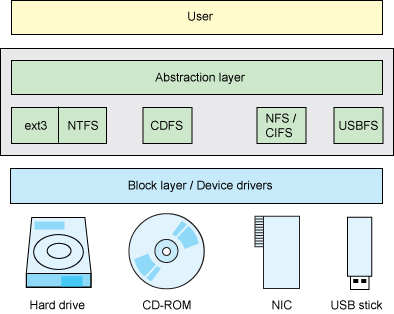

# 调研报告

## 项目简介

## 项目背景

### [虚拟文件系统](https://en.wikipedia.org/wiki/Virtual_file_system)

#### 简介

虚拟文件系统（VFS）是操作系统中的一个抽象层，它允许不同的文件系统（例如 [ext4](https://en.wikipedia.org/wiki/Ext4)、[NTFS](https://en.wikipedia.org/wiki/NTFS) 和 [FAT32](https://en.wikipedia.org/wiki/File_Allocation_Table)）以一致的方式呈现其内容。虚拟文件系统为应用程序提供了一个通用的文件系统 API 接口，亦可以用于透明地访问本地与网络存储设备而不让客户端应用程序察觉到差别。它可以用来弥合 Windows， macOS，以及 Unix 的文件系统之间的差异，以便于应用程序访问这些不同类型的本地文件系统上的文件，而无需得知其正在访问的文件系统类型。

虚拟文件系统规定了操作系统内核与具体文件系统之间的接口（或“合同”），因此，只需满足这些借口所需的条件即可向内核添加对新文件系统的支持。但是，这些文件接口所需要满足的条件可能随着操作系统版本的更新而发生变化，这便会要求对某一具体文件系统的支持程序进行一定的修改，并且重新编译操作系统内核。当然，操作系统的开发者也可以选择向后兼容的更新改版，使之前版本的具体文件系统支持程序继续工作在更新后的操作系统上。

#### 实现

Unix-like 系统上最早的虚拟文件系统机制之一是由 Sun Microsystem 在 1985 年的 [SunOS](https://en.wikipedia.org/wiki/SunOS) 2.0 中引入的。它允许 Unix 系统调用来透明地访问本地的 [UFS](https://en.wikipedia.org/wiki/Unix_File_System)(Unix File System) 文件系统和远程的 [NFS](https://en.wikipedia.org/wiki/Network_File_System)(Network File System) 文件系统。

John Heidemann 在 SunOS 4.0 下为试验性的 Ficus 文件系统开发了一个堆栈式的 VFS，此设计为语义相同的文件系统类型之间的代码复用提供了支持，例如，一个加密文件系统可以复用与一个非加密文件系统的所有命名代码与存储管理代码。Heidemann 将此项工作改编用于他论文研究中的 4.4[BSD](https://en.wikipedia.org/wiki/Berkeley_Software_Distribution)，之后这段代码的后代构成了现代 BSD，例如 macOS 的文件系统实现的基础。

其他 Unix 虚拟文件系统包括 [System V Release 3](https://en.wikipedia.org/wiki/UNIX_System_V) 中的文件系统开关、[Ultrix](https://en.wikipedia.org/wiki/Ultrix) 中的通用文件系统以及 Linux 中的 VFS。在 [OS/2](https://en.wikipedia.org/wiki/OS/2) 和 Microsoft Windows 中，虚拟文件系统机制被称为可安装文件系统（Installable File System）。

用户空间文件系统（Filesystem in Userspace，FUSE）机制允许用户空间的代码插入到 Linux、NetBSD、FreeBSD、[OpenSolaris](https://en.wikipedia.org/wiki/OpenSolaris) 和 macOS 中的虚拟文件系统机制中。   

在 Microsoft Windows 中，虚拟文件系统也可以通过用户空间的 Shell 命名空间扩展来实现；但是，它们不支持 Windows 中最低级别的文件系统访问应用程序编程接口，因此并非所有应用程序都能访问那些用于命名空间扩展的文件系统。[KDE](https://en.wikipedia.org/wiki/KDE_Projects) 和 [GNOME](https://en.wikipedia.org/wiki/GNOME) 桌面环境中的 [KIO](https://en.wikipedia.org/wiki/KIO) 和 [GVfs](https://en.wikipedia.org/wiki/GVfs)/[GIO](https://en.wikipedia.org/wiki/GIO_(software)) 提供类似的机制，具有类似的限制，尽管它们可以使用 FUSE 技术从而顺利地集成到系统中。

### 单文件虚拟文件系统

虚拟文件系统有时指的是一个文件或一组文件，而不一定在一个具体的文件系统中，它通过应用软件软件提供具体文件系统的功能。这些容器的例子包括 CBFS Storage 或模拟器中的单个虚拟文件系统，如 PCTask 或所谓的 Win[UAE](https://en.wikipedia.org/wiki/UAE_(emulator))，[Oracle](https://en.wikipedia.org/wiki/Oracle_Corporation) 的 [VirtualBox](https://en.wikipedia.org/wiki/VirtualBox)，Microsoft 的 [Virtual PC](https://en.wikipedia.org/wiki/Windows_Virtual_PC)，[VMware](https://en.wikipedia.org/wiki/VMware) 等。这种文件系统的主要优点是集中和易于移除。单文件虚拟文件系统可以包括任何文件系统所期望的基本功能（虚拟或其他），但对这些文件系统内部结构的访问通常有所限制，只能在专用程序下进行访问，而不是通过允许通用访问的驱动程序实现。另一个主要缺点是，与其他虚拟文件系统相比，性能会有所下降，主要原因是在虚拟文件系统中进行写入或删除时移动虚拟文件需花费大量的成本。

单文件虚拟文件系统的实现示例包括模拟器，如 PCTask 和 WinUAE，它们封装了文件系统数据以及模拟的磁盘布局。这使得将操作系统安装视为其他软件的一部分变得容易——可以通过可移动介质或网络传输。

PCTask 是 [Amiga](https://en.wikipedia.org/wiki/Amiga) 模拟器，模拟了一个以 4.77MHz 时钟速率工作的基于 Intel PC 8088 的机器（后来是以 25 MHz 时钟速率工作的 80486SX）。PCTask 的用户可以在 Amiga 文件系统上创建一个大文件，这个文件可以在模拟器中虚拟地访问，就像它是一个真正的 PC 硬盘一样。这个文件可以使用 FAT16 文件系统格式化，以存储正常的 MS-DOS 或 Windows 文件。

WinUAE 是Windows 的 UAE 模拟器，允许将 Windows 上的大型单个文件视为 Amiga 文件系统。在 WinUAE 中，这个文件被称为硬盘文件。UAE还可以将主机文件系统（Windows、Linux、macOS、AmigaOS）上的目录视为 Amiga 文件系统。

#### Linux 上的虚拟文件系统


上图为 VFS 层在 Linux 内核存储栈中相对各个部分的位置。

Linux文件系统的灵活性和可扩展性是抽象接口集的直接结果。这个接口集的核心是便虚拟文件系统开关（VFS）。

VFS为上层应用程序提供一组标准接口，以便在多种文件系统上执行文件读写，并支持在一个或多个底层设备上同时使用多个文件系统。此外，这些文件系统并不需要是静态的，它们可能会随着存储设备的瞬态性而改变。例如，一个典型的 Linux 桌面系统支持可用硬盘上的 ext3 文件系统，以及可用 [CD-ROM](https://en.wikipedia.org/wiki/CD-ROM) 上的 [ISO 9660](https://en.wikipedia.org/wiki/ISO_9660) 文件系统（也称为 CD-ROM 文件系统或 CDFS）。随着 CD-ROM 的插入和移除，Linux 内核必须适应这些具有不同内容和结构的新文件系统。远程文件系统可以通过网络文件系统（NFS）访问。同时，Linux 可以从本地硬盘上的 Windows/Linux 双启动系统中挂载 NT 文件系统（NTFS）分区，并从中读取和写入数据。

同样，可移动的 USB 闪存驱动器（UFD）可以热插拔，提供另一个文件系统。在此期间，这些相同的文件接口，允许将底层文件系统和物理设备抽象出来，以便用户使用，见下图。



##### Layered Abstraction


接下来，对 Linux VFS 提供的抽象特性添加一些具体的架构。上图展示了从 VFS 的角度看 Linux 栈的高层视图。在 VFS 的上方是标准内核系统调用接口（[SCI](https://en.wikipedia.org/wiki/Scalable_Coherent_Interface)）。这个接口允许用户空间的调用从不同的地址空间过渡到内核中。在这个域中，一个用户空间应用程序激发 [POSIX](https://en.wikipedia.org/wiki/POSIX) open call 通过 [GNU](https://en.wikipedia.org/wiki/GNU) C 库（[glibc](https://en.wikipedia.org/wiki/Glibc)）进入内核并进入系统调用解多路器。最终，使用 sys_open 调用 VFS。

VFS 提供抽象层，将 POSIX API 与特定文件系统实现该行为的细节分离。关键在于，无论底层文件系统是 ext3还是Btrfs，打开，读取，写入或关闭的 API 系统调用都是相同的。VFS提供了一个底层文件系统可以继承的共同文件模型（它们必须能够实现各种 POSIX API 的函数）。在VFS之外，还有一个抽象层将底层物理设备隐藏起来，这些底层物理设备可以是是磁盘、磁盘分区、网络存储实体、内存或任何能够存储信息，甚至是短暂存储介质。

除了将底层文件操作与可用文件系统联系起来，VFS还将底层块设备与可用文件系统联系起来。

##### VFS Internals

本节将探讨 superblock、index node（inode）、directory entry（dentry）和file object。这里还有一些其他重要元素，例如缓存，这些元素将在整体架构中进一步探讨。

###### Superblock

Superblock 是一个关于文件系统高级元数据的容器。Superblock 是一个存在于磁盘（实际上是多个位置上的冗余信息）和内存中的结构。它是处理磁盘上文件系统的基础，因为它定义了文件系统的管理参数，例如，总块数、可用块数、根索引节点。

在磁盘上，superblock 向内核提供有关磁盘上文件系统结构的信息。在内存中，superblock 提供了管理已挂载文件系统所需的信息和状态。因为 Linux 支持在同一时间挂载多个并发文件系统，所以每个 `super_block` 结构都在一个 `super_blocks` 列表中维护（`super_blocks` 在 `./linux/fs/super.c` 中定义，`super_block`结构在 `/linux/include/fs/fs.h` 中定义）。


上图为 superblock 及其元素的简化视图。`super_block` 结构引用了许多封装其他信息的结构体。例如，`file_system_type` 结构体维护文件系统的名称（如ext3）以及获取和删除 `super_block` 的各种锁和函数。`file_system_type` 对象通过著名的` register_file system` 和 `unregister_file system` 函数进行管理（见 `./linux/fs/file systems.c`）。`super_operations` 结构定义了读写索引节点以及更高级别操作的多个函数，如重新挂载。根目录条目（dentry）对象与此文件系统所在的块设备同样在此被缓存。最后，superblock 提供多个列表来管理索引节点，包括 `s_inodes`（所有索引节点的列表）、`s_dirty`（所有[脏索引节点][1]的列表）、`s_io` 和 `s_more_io`（停止进行写回）、`s_files`（给定文件系统的所有打开文件的列表）。

另外，Linux 内核中还有另一个管理对象称为 `vfsmount`，它提供有关挂载的文件系统的信息。这些对象的列表引用了 superblock 并定义了挂载点，文件系统所在的 `/dev` 设备的名称,以及其他更高级别的附加信息。

###### The Index Node (inode)

Linux 通过一个称为 inode（索引节点）的对象来管理文件系统中的所有对象。一个 inode 可以指向一个文件、一个目录或另一个对象的符号链接。因为文件用于表示其他类型的对象比如设备或内存，inode 也用于表示它们。

请注意，这里提到的 inode 是 VFS 层的 inode（内存 inode）。事实上，每个文件系统还包括一个 inode，它位于磁盘上，能够提供有关特定文件系统对象的详细信息。

VFS inode 使用 [slab 分配器][2]（来自 `inode_cache`）进行分配。其由描述 inode 与内容以及可能在 inode 上执行的各种操作的数据和操作组成。

```C
struct list_head i_dentry;
struct timespec i_atime;
struct timespec i_mtime;
struct timespec i_ctime;
gid_t i_gid;
uid_t i_uid;
loff_t i_size;
const struct file_operations * i_fop;
const struct inode_operations * i_op;
struct address_space * i_maping;
struct address_space * i_data;
…
```

以上是一个简单的 VFS inode 示例，包含多个列表，其中一个列表引用了指向此 inode 的 dentries。对象级元数据包括熟悉的操作时间（创建时间、访问时间、修改时间），以及所有者和权限数据（group-id、user-ID 和 permissions）。inode 引用了可能在其上执行的文件操作，其中大多数直接映射到系统调用接口（例如，`open`、`read`、`write` 和 `flush`）。还有一个引用 inode 特定操作的结构（如 `create`、`lookup`、`link`、`mkdir` 等）。最后，还有一个结构来管理由地址空间对象表示的对象的实际数据。`address space` 对象是一个管理 inode 在页面缓存中的各个页面的对象。地址空间对象用于管理文件的页面，并将文件段映射到各个进程地址空间中。地址空间对象配有自己的操作集（`writepage`、`readpage`、`releasepage` 等）。

###### Directory Entry (dentry)

Linux 中的另一个对象，称为 `dentry` 对象，它用于管理文件系统的分层结构。文件系统有一个根 dentry（在 `super_block` 中被引用），这是唯一一个没有 parent 的 dentry。所有其他 dentry 都有 parent，有些有 children。例如，如果打开了由 `/home/user/name` 组成的文件，则将会有四个 dentry 对象被创建：一个用于根目录 `/`，一个用于根目录的 `home` 条目，一个用于 `user` 目录的 `name` 条目，最后，一个用于 `user` 目录的 `name` 条目的 `dentry`。通过这种方式，dentry 在今天使用的分层文件系统中拥有非常清晰的映射。

dentry 对象由 `dentry` 结构（位于 `./linux/include/fs/dcache.h`）定义。它包括一些用于跟踪该条目与文件系统中其他条目关系，以及物理数据（例如文件名）的元素。

```C
struct wuper_block * d_sb;
struct dentry * d_parent;
struct list_head d_subdirs;
struct dentry_operations * d_op;
unsigned char d_iname[];
struct inod * d_inode;
…
```

以上展示了 dentry 对象的简化视图。dentry 引用了 super_block，而 `super_block` 定义了包含该对象的特定文件系统实例。接下来是该对象的 parent dentry（父目录），后跟包含在列表中的 child dentry（如果该对象恰好是目录），然后定义了 dentry 的操作（包括 `hash`，`compare`，`delete`，`release` 等操作）。对象的名称随后被定义，该名称在 dentry 中而不是 inode 本身中保存。最后，提供了对VFS inode的引用。

请注意，dentry 对象仅存在于文件系统内存中，不会存储在磁盘上。只有文件系统 inode 被永久存储，而 dentry 对象用于提高性能。可以在` ./linux/include/dcache.h` 中查看 dentry 结构的完整描述。

###### File Object

对于 Linux 系统中每个打开的文件，都存在一个文件对象。该对象包含给定用户的打开实例的相关信息。文件对象的一个较为简化的视图下面中提供。 

```C
struct path    f_path;
struct dentry (f_path, dentry);
const struct file_operations * f_op;
unsigned int f_flags;
fmode_t f_mode;
lodd_t f_ops;
…
```

如图所示，路径结构提供了对 dentry 和 vfsmount 的引用。为每个文件定义了一组文件操作，这些操作是众所周知的文件操作（例如打开、关闭、读取、写入、刷新等）。还定义了一组标志和权限（包括组和所有者）。最后，为特定的文件实例定义了有状态数据，例如文件的当前偏移量。

##### Object Relationships

在回顾了VFS层中各种重要对象之后，看看它们在一个单独的图表中的关系。因为本文是以自下而上的方式探讨了对象，现在将从用户的角度看一下相反的情况，见下图。


顶部是打开的文件对象，由进程的文件描述符列表引用。文件对象引用一个 `dentry` 对象，该对象引用一个 inode。`inode` 和 `dentry` 对象都引用底层的 `super_block` 对象。多个文件对象可以引用同一个 `dentry`（例如两个用户共享同一个文件）。请注意，在上图中，`dentry` 对象引用另一个 `dentry` 对象。在这种情况下，一个目录引用文件，而文件则引用特定文件的 `inode`。

##### The VFS Architecture

VFS（虚拟文件系统）的内部架构由一个提供文件系统抽象的分派层和一些缓存组，以此能够提高文件系统操作的性能。本节将探讨内部架构以及主要对象之间的交互，见下图。


在 VFS 中，两个主要的动态管理对象包括 `dentry` 和 `inode` 对象。将这些对象缓存可以提高对底层文件系统的访问性能。当打开一个文件时，`dentry` 缓存将被填充以表示路径所代表的目录级别的条目。同时还会创建一个 inode 表示文件的对象。`dentry` 缓存使用哈希表构建，由对象名称进行哈希。`dentry` 缓存的条目是从 `dentry_cache` 的 slab 分配器中分配的，并使用最近最少使用（[LRU](https://en.wikipedia.org/wiki/Cache_replacement_policies#LRU)）算法来修剪条目以应对内存压力。与 `dentry` 缓存相关的函数可以在 `./linux/fs/dcache.c`和 `./linux/include/linux/dcache.h` 中找到。

`inode` 缓存是由两个列表和一个哈希表实现的，这样可以实现更快地查找。第一个列表定义了当前正在使用的 `inodes`，第二个列表定义了未使用的 `inodes`。正在使用的 `inodes` 也存储在哈希表中。从 `inode_cache` 的 slab 分配器中分配单个 `inode` 缓存对象。与 `inode` 缓存相关的函数可以在` ./linux/fs/inode.c` 与 `./linux/include/fs.h ` 中找到。

从实现来看，`dentry` 缓存是 `inode` 缓存的主控制器。当 `dentry` 对象存在时，`inode` 对象也会存在于 `inode` 缓存中。在 `dentry` 缓存上执行查找，将导致在 `inode` 缓存中获得一个对象。

## 立项依据

## 前瞻性分析

## 相关工作

1. Official Linux Kernel Archive 中有对与 Linux 系统中的虚拟文件系统的综述。详情参考：https://www.kernel.org/doc/html/latest/filesystems/vfs.html
2. 这篇文章 [*Model-Checking the Linux Virtual File System*](./ref/Model-Checking the Linux Virtual File System.pdf) 介绍了对 Linux 虚拟文件系统（VFS）进行建模和验证的案例研究。其展示了如何提取 Linux VFS 实现的可执行模型，通过使用 SPIN 的模拟功能验证模型，并使用 SMART 模型检查器分析其是否遵循数据完整性约束和死锁自由。
3. 这篇文章 [A Virtual File System for IoT Service Platform Based on Linux FUSE](ref/Modular Integration of Crashsafe Caching into a Verified Virtual File System Switch.pdf) 展示了如何向虚拟文件系统交换机(VFS)添加非顺序保留缓存，并提供了一个适用于这种缓存特性的新型崩溃安全准则。针对每个单独的文件，可以通过构建一条替代的运行路径来解释断电事件，该路径中自上次同步该文件以来的所有写入都写了一个前缀，以实现在断电后安全恢复文件。

## 参考

[1]:  脏索引节点（Dirty Index Node）是指在文件系统中，如果一个索引节点（Inode）被修改但还没有被写回磁盘，那么它就被认为是“脏”的。索引节点是一个包含文件元数据（如文件大小、所有者、权限等）的数据结构，它们通常存储在文件系统的内存缓存中以提高文件系统性能。当一个索引节点被修改时，为了保持文件系统的一致性，必须在一定时间内将其写回磁盘中，否则可能会导致数据损坏或丢失。脏索引节点通常是由于系统崩溃、断电或其他故障导致的。当系统重新启动时，它将检查所有的脏索引节点并将它们写回磁盘以确保文件系统的完整性。如果脏索引节点不能被恢复或写回磁盘，那么文件系统可能会出现损坏或数据丢失的情况。因此，及时地检测和处理脏索引节点是非常重要的。

[2]:  Slab 分配器（Slab Allocator）是 Linux 内核中的一种内存分配器。它的主要目的是在动态分配内存时提高内核的性能和效率。slab 分配器使用一组预先分配的内存块（slabs）来管理内存的分配和释放。这些内存块的大小通常与常用的数据结构大小相匹配，例如 inode 和 dentry 等。

在使用 slab 分配器时，内存块会被分为三类：已分配、空闲和缓存。已分配的块是已经被内核分配给进程使用的块，而空闲的块则可以被内核重新分配给其他进程。缓存的块则是一些预先分配的块，用于加速内核对于特定数据结构的内存分配操作。当需要为某个数据结构分配内存时，内核会先从相应的缓存中获取一个块，如果缓存中没有空闲的块，就会从空闲块中获取一个块。如果空闲块也没有可用的块，那么 slab 分配器就会从操作系统的虚拟内存中获取一块。

使用slab分配器可以避免频繁的内存分配和释放操作，从而提高内核的性能和效率。它在 Linux 内核中被广泛使用，用于管理各种内核对象，包括文件系统对象（如 inode 和 dentry）、网络协议栈对象（如 socke t和 [TCP](https://en.wikipedia.org/wiki/Transmission_Control_Protocol) 协议控制块）、设备驱动程序对象和进程管理对象等。


[../ref/Model-Checking the Linux Virtual File System.pdf]:
